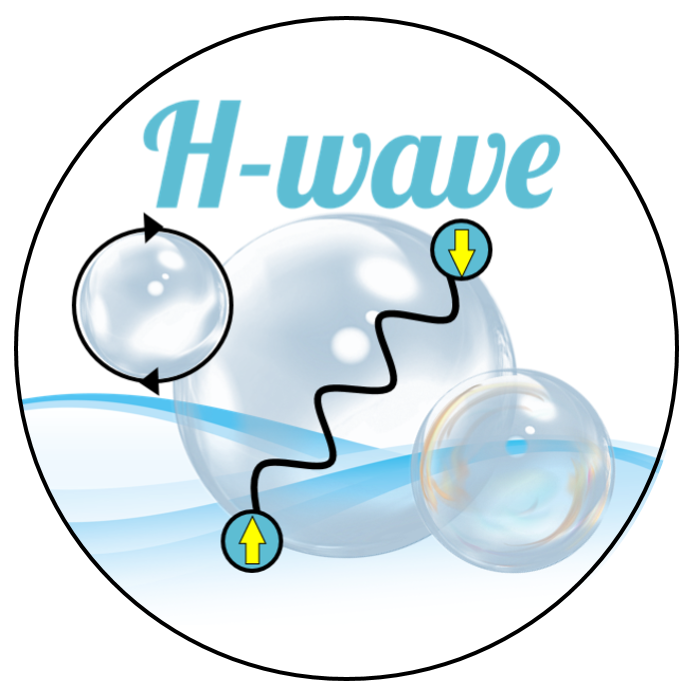

# H-wave

<div align="center">
  
</div>

[](https://github.com/issp-center-dev/H-wave/actions/workflows/run_tests.yml)
[](https://github.com/issp-center-dev/H-wave/actions/workflows/ci-python39.yml)
[](https://pypi.org/project/hwave/)
[](https://www.python.org/downloads/)
[](https://www.gnu.org/licenses/gpl-3.0)
[](https://www.pasums.issp.u-tokyo.ac.jp/h-wave/en/doc/manual)

H-wave is a Python package for performing unrestricted Hartree-Fock (UHF) approximation and random phase approximation (RPA) for itinerant electron systems. UHF and RPA correspond to simple approximations that deal with fluctuations up to first order and enable analyses of electron correlation effects in materials at a low computational cost. The input files describing the one-body and two-body interactions are based on the Wannier90 format[1]. This allows smooth connection for the software packages that derive the effective models from first principles calculations, such as RESPACK[2], to the analyses of the effective model with H-wave.

[1] G. Pizzi et al, J. Phys.: Condens. Matter 32 165902 (2020).
[2] K. Nakamura, Y. Yoshimoto, Y. Nomura et al., Comp. Phys. Commun. 261, 107781 (2021).

## Features

- **Unrestricted Hartree-Fock (UHF) approximation** and **Random Phase Approximation (RPA)** for itinerant electron systems
- **Target models**: Hubbard, multi-orbital Hubbard, and extended Hubbard models
- **Interaction types**: Coulomb intra/inter, Exchange, Hund, Ising, PairHop, PairLift
- **Output**: ground-state energy, free energy, charge/spin susceptibilities, Green's functions
- **Wannier90 format compatibility** for seamless integration with first-principles calculations

## Installation

```bash
pip install hwave
```

For development:

```bash
git clone https://github.com/issp-center-dev/H-wave.git
cd H-wave
pip install -e .
```

## Quick Start

```bash
# Run UHF/RPA calculation
hwave input.toml

# Calculate DOS
hwave_dos input.toml
```

For input file format and examples, see the [User Manual](https://www.pasums.issp.u-tokyo.ac.jp/h-wave/en/doc/manual).

## Testing

```bash
# Run all tests
pytest tests/ -v
```

## Citing

We would appreciate it if you cite the following article in your research with H-wave:

T. Aoyama, K. Yoshimi, K. Ido, Y. Motoyama, T. Kawamura, T. Misawa, T. Kato, and A. Kobayashi,
"H-wave -- A Python package for the Hartree-Fock approximation and the random phase approximation",
[Computer Physics Communications, 298, 109087 (2024)](https://doi.org/10.1016/j.cpc.2024.109087).

## Links

- [H-wave project site](https://www.pasums.issp.u-tokyo.ac.jp/h-wave/en)
- [User Manual](https://www.pasums.issp.u-tokyo.ac.jp/h-wave/en/doc/manual)
- [Tutorial Examples](https://github.com/issp-center-dev/H-wave/tree/main/docs/tutorial)
- [Data Repository](https://datarepo.mdcl.issp.u-tokyo.ac.jp/repo/23)

## License

The distribution of the program package and the source codes for H-wave follow
GNU General Public License version 3
([GPL v3](https://www.gnu.org/licenses/gpl-3.0.en.html)).

Copyright (c) <2022-> The University of Tokyo. All rights reserved.

This software was developed with the support of
"Project for Advancement of Software Usability in Materials Science"
of The Institute for Solid State Physics, The University of Tokyo.

## Authors

Kazuyoshi Yoshimi (ISSP, Univ. of Tokyo),
Yuichi Motoyama (ISSP, Univ. of Tokyo),
Tatsumi Aoyama (ISSP, Univ. of Tokyo),
Kota Ido (ISSP, Univ. of Tokyo),
Takahiro Misawa (ISSP, Univ. of Tokyo),
Taiki Kawamura (Nagoya Univ.),
Akito Kobayashi (Nagoya Univ.),
Takeo Kato (ISSP, Univ. of Tokyo)
