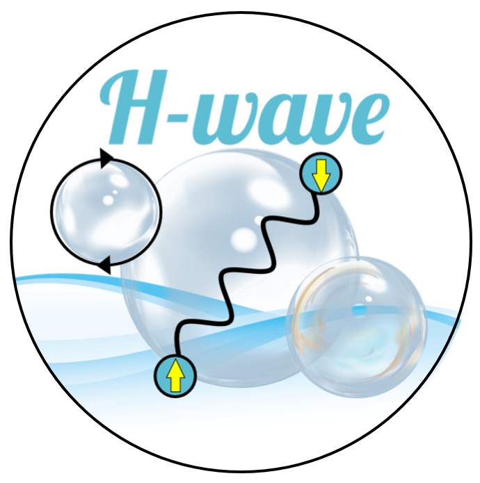

# H-wave

<div align="center">
  
</div>

[](https://github.com/issp-center-dev/H-wave/actions/workflows/run_tests.yml)
[](https://github.com/issp-center-dev/H-wave/actions/workflows/ci-python39.yml)
[](https://pypi.org/project/hwave/)
[](https://www.python.org/downloads/)
[](https://www.gnu.org/licenses/gpl-3.0)
[](https://www.pasums.issp.u-tokyo.ac.jp/h-wave/en/doc/manual)

H-wave is a Python package for performing the unrestricted Hartree-Fock (UHF) approximation, the random phase approximation (RPA), and the fluctuation exchange approximation (FLEX) for itinerant electron systems. UHF and RPA correspond to simple approximations that deal with fluctuations up to first order and enable analyses of electron correlation effects in materials at a low computational cost. FLEX extends RPA self-consistently to capture higher-order fluctuations, and the bundled linearized Eliashberg equation solver analyzes superconducting instabilities (the leading pairing eigenvalue and the gap function) on top of RPA/FLEX results. The input files describing the one-body and two-body interactions are based on the Wannier90 format[1]. This allows smooth connection for the software packages that derive the effective models from first principles calculations, such as RESPACK[2], to the analyses of the effective model with H-wave.

[1] G. Pizzi et al, J. Phys.: Condens. Matter 32 165902 (2020).
[2] K. Nakamura, Y. Yoshimoto, Y. Nomura et al., Comp. Phys. Commun. 261, 107781 (2021).

## Features

- **Unrestricted Hartree-Fock (UHF) approximation** in both real space (`UHFr`) and wave-number space (`UHFk`)
- **Random Phase Approximation (RPA)** for charge/spin susceptibilities
- **Fluctuation Exchange Approximation (FLEX)** — self-consistent RPA with dressed Green's functions and self-energy
- **Linearized Eliashberg equation solver** (`hwave_sc`) for superconducting instability analysis (leading pairing eigenvalue and gap function) built on RPA/FLEX susceptibilities
- **Spin-orbital mode** in UHFk for systems with spin-orbit coupling
- **Target models**: Hubbard, multi-orbital Hubbard, and extended Hubbard models
- **Interaction types**: Coulomb intra/inter, Exchange, Hund, Ising, PairHop, PairLift
- **Output**: ground-state energy, free energy, charge/spin susceptibilities, Green's functions, self-energy, density of states
- **Wannier90 format compatibility** for seamless integration with first-principles calculations

## Installation

```bash
pip install hwave
```

For development:

```bash
git clone https://github.com/issp-center-dev/H-wave.git
cd H-wave
pip install -e .
```

## Quick Start

```bash
# Run UHF / RPA / FLEX calculation (mode selected in input.toml)
hwave input.toml

# Calculate DOS
hwave_dos input.toml

# Solve the linearized Eliashberg equation (superconducting analysis).
# Reads the susceptibility produced by a preceding run: chi0q from an
# RPA run (chi0q_mode = "load"), or chiq_s/chiq_c from a FLEX run
# (chi0q_mode = "flex"), as selected in the [eliashberg] section.
hwave_sc input.toml
```

For input file format and examples, see the [User Manual](https://www.pasums.issp.u-tokyo.ac.jp/h-wave/en/doc/manual).

## Examples

Ready-to-run sample inputs for each mode are included in the repository:

| Mode | Description | Sample |
|------|-------------|--------|
| `UHFr` | Real-space UHF on an 8-site Hubbard cluster | [docs/tutorial/Hubbard/UHFr](docs/tutorial/Hubbard/UHFr) |
| `UHFk` | Wave-number-space UHF (Wannier90 input) | [docs/tutorial/Hubbard/UHFk](docs/tutorial/Hubbard/UHFk) |
| `RPA` | Charge/spin susceptibilities on a 2D square lattice | [docs/tutorial/Hubbard/RPA](docs/tutorial/Hubbard/RPA) |
| `FLEX` | Self-consistent RPA, single-orbital Hubbard | [docs/tutorial/Hubbard/FLEX/1orb](docs/tutorial/Hubbard/FLEX/1orb) |
| `FLEX` | Self-consistent RPA, two-orbital Hubbard | [docs/tutorial/Hubbard/FLEX/2orb](docs/tutorial/Hubbard/FLEX/2orb) |
| `FLEX` | Self-consistent RPA, multi-orbital (iron) model | [docs/tutorial/Hubbard/FLEX/iron_2orb](docs/tutorial/Hubbard/FLEX/iron_2orb) |
| `FLEX` | Full-vertex paramagnetic multi-orbital (iron), `calc_scheme="general"` | [docs/tutorial/Hubbard/FLEX/iron_2orb_general](docs/tutorial/Hubbard/FLEX/iron_2orb_general) |
| `hwave_sc` | Linearized Eliashberg equation, singlet pairing | [docs/tutorial/Hubbard/SC](docs/tutorial/Hubbard/SC) (`input.toml`) |
| `hwave_sc` | Linearized Eliashberg equation, triplet pairing | [docs/tutorial/Hubbard/SC](docs/tutorial/Hubbard/SC) (`input_triplet.toml`) |

Each directory contains an `input.toml` plus the interaction-definition files
it needs — `.def` files for the real-space `UHFr` case, and Wannier90-format
(`.dat`) files for the wave-number-space `UHFk`/`RPA`/`FLEX`/SC cases. The
UHF/RPA/FLEX cases run directly with `hwave input.toml`. The Eliashberg samples
are two-step: first generate the susceptibility with `hwave input.toml` (RPA),
then solve the gap equation with `hwave_sc input.toml` (use
`input_triplet.toml` for the triplet case).
See the [Tutorial](docs/tutorial) and the
[User Manual](https://www.pasums.issp.u-tokyo.ac.jp/h-wave/en/doc/manual) for
step-by-step walkthroughs.

## Testing

```bash
# Run all tests
pytest tests/ -v
```

## Citing

We would appreciate it if you cite the following article in your research with H-wave:

T. Aoyama, K. Yoshimi, K. Ido, Y. Motoyama, T. Kawamura, T. Misawa, T. Kato, and A. Kobayashi,
"H-wave -- A Python package for the Hartree-Fock approximation and the random phase approximation",
[Computer Physics Communications, 298, 109087 (2024)](https://doi.org/10.1016/j.cpc.2024.109087).

## Links

- [H-wave project site](https://www.pasums.issp.u-tokyo.ac.jp/h-wave/en)
- [User Manual](https://www.pasums.issp.u-tokyo.ac.jp/h-wave/en/doc/manual)
- [Tutorial Examples](https://github.com/issp-center-dev/H-wave/tree/main/docs/tutorial)
- [Data Repository](https://datarepo.mdcl.issp.u-tokyo.ac.jp/repo/23)

## License

The distribution of the program package and the source codes for H-wave follow
GNU General Public License version 3
([GPL v3](https://www.gnu.org/licenses/gpl-3.0.en.html)).

Copyright (c) <2022-> The University of Tokyo. All rights reserved.

This software was developed with the support of
"Project for Advancement of Software Usability in Materials Science"
of The Institute for Solid State Physics, The University of Tokyo.

## Authors

Kazuyoshi Yoshimi (ISSP, Univ. of Tokyo),
Yuichi Motoyama (ISSP, Univ. of Tokyo),
Tatsumi Aoyama (ISSP, Univ. of Tokyo),
Kota Ido (ISSP, Univ. of Tokyo),
Takahiro Misawa (ISSP, Univ. of Tokyo),
Taiki Kawamura (Nagoya Univ.),
Akito Kobayashi (Nagoya Univ.),
Takeo Kato (ISSP, Univ. of Tokyo)
