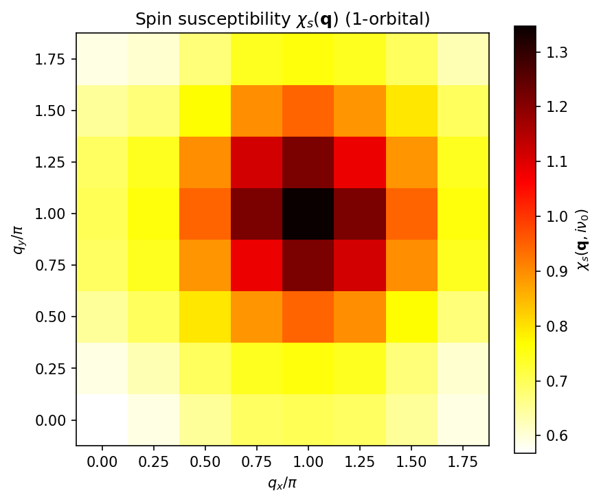
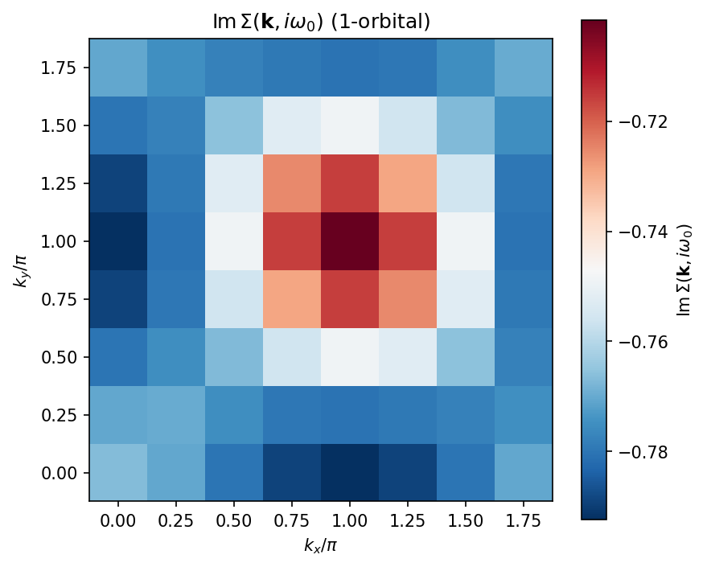
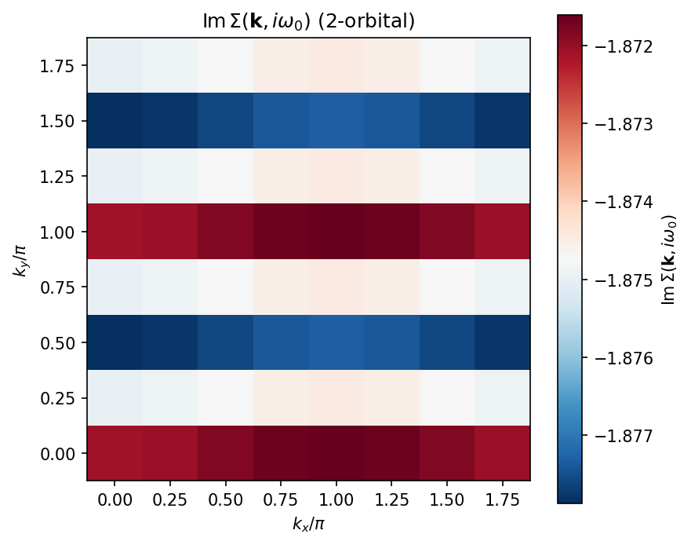
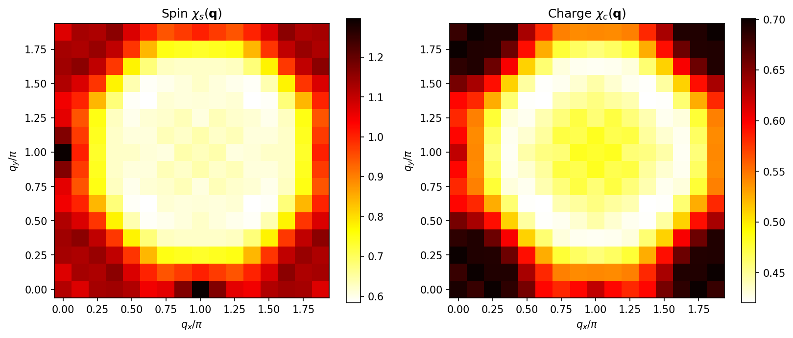

==========================================
Tutorial: FLEX solver
==========================================

This tutorial demonstrates how to use the FLEX
(Fluctuation Exchange Approximation) solver in H-wave.
FLEX extends RPA by using dressed (self-consistent) Green's functions
instead of bare ones, providing a more accurate description of
correlated electron systems.

The sample files for this tutorial are located in
``docs/en/source/flex/sample`` directory.

Overview
----------------------------

The FLEX approximation [1]_ is a self-consistent diagrammatic method
for itinerant electron systems. Unlike RPA, which uses the bare
Green's function :math:`G_0`, FLEX iterates the following self-consistent loop
until convergence:

1. Compute the dressed Green's function :math:`G(\mathbf{k}, i\omega_n)`
   from the Dyson equation.
2. Compute the bare susceptibility :math:`\chi_0(\mathbf{q}, i\nu_m)`
   from the dressed :math:`G`.
3. Decompose the interaction into spin and charge channels.
4. Solve the RPA equations for spin/charge susceptibilities
   :math:`\chi_s` and :math:`\chi_c`.
5. Construct the effective interaction :math:`V_{\mathrm{eff}}`.
6. Compute the self-energy :math:`\Sigma(\mathbf{k}, i\omega_n)` via
   FFT convolution.
7. Check convergence; if not converged, go to step 1.

.. note::

   When the electron number is fixed through ``filling`` / ``Ncond`` (rather
   than a fixed ``mu``), FLEX re-solves the chemical potential :math:`\mu` from
   the *dressed* Green function at every SCF iteration so that the target
   filling is maintained self-consistently as the self-energy grows.  A
   ``FLEX._find_mu_dressed: mu = ...`` line is therefore printed each iteration,
   and the converged :math:`\mu` (and the exact iteration count) differ from a
   calculation that keeps :math:`\mu` fixed at its non-interacting value.  All
   iteration counts and convergence values shown in this tutorial are
   illustrative and may vary slightly with the version and platform.

Theory
----------------------------

Dressed Green's function
^^^^^^^^^^^^^^^^^^^^^^^^^^^^^^^^

The dressed Green's function is obtained from the Dyson equation:

.. math::

   G(\mathbf{k}, i\omega_n)
   = \left[ G_0^{-1}(\mathbf{k}, i\omega_n) - \Sigma(\mathbf{k}, i\omega_n) \right]^{-1}

where :math:`G_0^{-1}(\mathbf{k}, i\omega_n) = i\omega_n + \mu - H_0(\mathbf{k})`
is the inverse bare Green's function.

Spin and charge susceptibilities
^^^^^^^^^^^^^^^^^^^^^^^^^^^^^^^^

The bare susceptibility is computed from the dressed Green's function:

.. math::

   \chi_0(\mathbf{q}, i\nu_m) = -\frac{T}{N_k} \sum_{\mathbf{k}, n}
   G(\mathbf{k}+\mathbf{q}, i\omega_n + i\nu_m)\, G(\mathbf{k}, i\omega_n)

The spin and charge susceptibilities are:

.. math::

   \chi_s = \left[ I - \chi_0 \, U_s \right]^{-1} \chi_0

.. math::

   \chi_c = \left[ I + \chi_0 \, U_c \right]^{-1} \chi_0

where :math:`U_s` and :math:`U_c` are the spin and charge interaction vertices
decomposed from the full interaction Hamiltonian.
For the single-band Hubbard model, :math:`U_s = U_c = U`.

Effective interaction
^^^^^^^^^^^^^^^^^^^^^^^^^^^^^^^^

The effective FLEX interaction combines spin and charge fluctuations [1]_:

.. math::

   V_{\mathrm{eff}}(\mathbf{q}, i\nu_m)
   = W \left[ \frac{3}{2}\chi_s
            + \frac{1}{2}\chi_c - \chi_0 \right] W

where :math:`W` is the bare interaction vertex.
:math:`\chi_0` is subtracted **once**: at lowest order
:math:`\chi_s = \chi_c = \chi_0`, so the bracket reduces to :math:`\chi_0` and
:math:`V_{\mathrm{eff}} = W \chi_0 W` (the second-order :math:`U^2` bubble).
This single subtraction removes the double-counted second-order diagram
contained in :math:`\chi_s` and :math:`\chi_c`.

Self-energy
^^^^^^^^^^^^^^^^^^^^^^^^^^^^^^^^

The self-energy is computed via convolution in real space and
imaginary time:

.. math::

   \Sigma(\mathbf{r}, \tau) = V_{\mathrm{eff}}(\mathbf{r}, \tau) \cdot G(\mathbf{r}, \tau)

This element-wise (Hadamard) product is efficiently evaluated using FFT.

.. _flex_scope:

Scope of the approximation
^^^^^^^^^^^^^^^^^^^^^^^^^^^^^^^^

FLEX is a conserving (Baym--Kadanoff) approximation that resums the RPA
particle--hole bubble and ladder series for the self-energy. It does **not**
include the Aslamazov--Larkin (AL) or Maki--Thompson (MT) vertex corrections,
in which the electron couples to *two* fluctuation propagators through a
triangular fermion loop (mode--mode coupling). These higher-order corrections
are outside the FLEX class and are **not** evaluated here. They can matter when
charge/orbital fluctuations driven by two spin fluctuations are important
(e.g. the orbital-fluctuation mechanism of Onari and Kontani [2]_).

In addition, the default ``calc_scheme = "reduced"`` and ``"squashed"``
schemes decompose the interaction via its density--density part for the
spin/charge vertices; off-diagonal (spin-flip Hund, pair-hopping) vertices
are reduced to their density--density component (a warning is emitted when
``Exchange``/``PairHop`` interactions are supplied). Accordingly, in these
schemes "FLEX" means *not exact*: it is the density--density, AL/MT-free
fluctuation-exchange level of approximation.

The alternative ``calc_scheme = "general"`` instead **retains** the full
off-diagonal Kanamori vertices. It is a paramagnetic full-vertex
formulation following Mochizuki, Yanase, and Ogata (MYO) [3]_ (and
corroborated by Takimoto, Hotta, and Ueda (THU) [4]_): the full matrix-form
spin (:math:`\hat{U}^s`) and charge (:math:`\hat{U}^c`) interaction matrices
are built in the MYO convention, the matrix RPA is solved for
:math:`\chi_s`/:math:`\chi_c`, and the fluctuation interaction is assembled
as :math:`V = \tfrac{3}{2}\hat{U}^s\chi_s\hat{U}^s
+ \tfrac{1}{2}\hat{U}^c\chi_c\hat{U}^c
- \tfrac{1}{4}(\hat{U}^s+\hat{U}^c)\chi_0(\hat{U}^s+\hat{U}^c)`.
Under ``"general"`` the off-diagonal vertices are therefore **not** dropped
and the density--density reduction warning is suppressed. The AL/MT vertex
corrections noted above remain outside the FLEX class even in the
``"general"`` scheme.

.. [1] N. E. Bickers and D. J. Scalapino,
   Ann. Phys. (N.Y.) **193**, 206 (1989).

.. [2] H. Kontani and S. Onari,
   Phys. Rev. Lett. **104**, 157001 (2010).

.. [3] M. Mochizuki, Y. Yanase, and M. Ogata,
   J. Phys. Soc. Jpn. (cond-mat/0407094).

.. [4] T. Takimoto, T. Hotta, and K. Ueda,
   Phys. Rev. B **69**, 104504 (2004); cond-mat/0309575.

Sample 1: Single-orbital Hubbard model
-----------------------------------------

Model
^^^^^^^^^^^^^^^^^^^^^^^^^^^^^^^^

The first sample is a **single-orbital Hubbard model** on a
two-dimensional square lattice at half filling (:math:`n = 1`).

.. math::

   H = -\sum_{\langle i,j \rangle, \sigma} t_{ij}\,
       c^\dagger_{i\sigma} c_{j\sigma}
     + U \sum_i n_{i\uparrow} n_{i\downarrow}

with nearest-neighbor hopping :math:`t = 1.0`,
next-nearest-neighbor hopping :math:`t' = 0.5`,
on-site Coulomb repulsion :math:`U = 4.0`,
and temperature :math:`T = 0.5`.

This model is known to exhibit strong antiferromagnetic (AF) spin
fluctuations with a peak at :math:`\mathbf{Q} = (\pi, \pi)`.

Prepare input files
^^^^^^^^^^^^^^^^^^^^^^^^^^^^^^^^

The sample files are in ``docs/en/source/flex/sample/1orb/``.

**Parameter file** (``input.toml``):

.. literalinclude:: ../sample/1orb/input.toml

Key parameters:

- ``mode = "FLEX"``: Selects the FLEX solver.
- ``T = 0.5``: Temperature.
- ``CellShape = [8, 8, 1]``: 8 x 8 k-point mesh for a 2D system.
- ``Nmat = 64``: Number of Matsubara frequencies.
- ``filling = 0.5``: target electron number per site (half filling). Specifying
  ``filling`` (or ``Ncond``) makes FLEX re-solve the chemical potential
  :math:`\mu` from the dressed Green's function at every SCF iteration so the
  filling is conserved as the self-energy grows; specifying ``mu`` instead holds
  it fixed.
- ``coeff_tail = 1.0`` (optional): high-frequency tail-acceleration coefficient
  for the Matsubara sums. ``coeff_tail = 1`` matches the exact
  :math:`1/(i\omega_n)` coefficient of :math:`G` (unitarity), so it accelerates
  convergence in ``Nmat`` without biasing the result. Also supported by the RPA
  solver.
- ``IterationMax = 100``: Maximum number of SCF iterations.
- ``Mix = 0.2``: Mixing parameter for self-energy update
  (:math:`\Sigma_{\mathrm{new}} = (1 - \alpha)\Sigma_{\mathrm{old}} + \alpha\Sigma_{\mathrm{calc}}`).
- ``EPS = 6``: Convergence criterion :math:`10^{-6}`.

**Geometry** (``geom.dat``):

.. literalinclude:: ../sample/1orb/geom.dat

A single orbital at the origin.

**Transfer integrals** (``transfer.dat``):

.. literalinclude:: ../sample/1orb/transfer.dat

Nearest-neighbor (:math:`t = 1.0`) and next-nearest-neighbor
(:math:`t' = 0.5`) hopping on the square lattice.

**On-site interaction** (``coulombintra.dat``):

.. literalinclude:: ../sample/1orb/coulombintra.dat

On-site Coulomb repulsion :math:`U = 4.0`.

Run the calculation
^^^^^^^^^^^^^^^^^^^^^^^^^^^^^^^^

.. code-block:: bash

    $ cd docs/en/source/flex/sample/1orb
    $ hwave input.toml

The output log shows the SCF convergence:

.. code-block:: text

    FLEX iteration 1/100
    FLEX._find_mu_dressed: mu = -0.398893
      convergence: |dSigma|/|Sigma| = 1.000e+00
    FLEX iteration 2/100
    FLEX._find_mu_dressed: mu = -0.291966
      convergence: |dSigma|/|Sigma| = 9.876e-01
    ...
    FLEX iteration 64/100
    FLEX._find_mu_dressed: mu = -0.249146
      convergence: |dSigma|/|Sigma| = 9.241e-07
    FLEX converged after 64 iterations

Results
^^^^^^^^^^^^^^^^^^^^^^^^^^^^^^^^

After convergence, the solver produces the following output files
in the ``output`` directory:

- ``chi0q.npz``: Bare susceptibility :math:`\chi_0(\mathbf{q}, i\nu_m)`
- ``chiq_s.npz``: Spin susceptibility :math:`\chi_s(\mathbf{q}, i\nu_m)`
- ``chiq_c.npz``: Charge susceptibility :math:`\chi_c(\mathbf{q}, i\nu_m)`
- ``chiq.npz``: Combined susceptibility file
- ``sigma.npz``: Self-energy :math:`\Sigma(\mathbf{k}, i\omega_n)`
- ``green.npz``: Dressed Green's function :math:`G(\mathbf{k}, i\omega_n)`
- ``energy.dat``: Text file with the particle number ``NCond``, spin
  ``Sz``, and the converged ``ChemicalPotential`` :math:`\mu`.

.. note::

   The ``energy.dat`` output (enabled by the ``energy`` key in
   ``[file.output]``) is written from the final dressed Green function.  In
   the fixed-:math:`\mu` mode (specify ``mu`` instead of ``filling`` /
   ``Ncond``) its ``NCond`` line gives the particle number at that
   :math:`\mu`, so running the solver at several fixed :math:`\mu` values
   traces the :math:`\mu`-:math:`N` relation.  ``Sz`` is zero for a
   paramagnetic (spin-free) calculation and non-zero only for
   spin-dependent (spin-diagonal / spinful) runs.

Warm-starting the SCF loop (``sigma_init``)
^^^^^^^^^^^^^^^^^^^^^^^^^^^^^^^^^^^^^^^^^^^^^

By default FLEX starts the self-consistency loop from :math:`\Sigma = 0`.
Setting ``sigma_init`` in ``[file.input]`` to a ``sigma.npz`` written by an
earlier FLEX run instead seeds the loop from that self-energy:

.. code-block:: toml

   [file.input]
     sigma_init = "sigma.npz"

This is often decisive near a magnetic instability (low temperature, strong
spin fluctuations), where the :math:`\Sigma = 0` transient makes the SCF
*oscillate* (the residual ``|dSigma|/|Sigma|`` stalls around 1 instead of
decreasing) and the run hits ``IterationMax`` without converging. Starting from
a converged neighbouring solution -- for example, stepping the temperature down
and feeding each run the previous (higher-:math:`T`) ``sigma.npz`` -- begins the
iteration near the fixed point and avoids the oscillation. The seed must have
the same ``CellShape`` and ``Nmat`` as the current run (both are fail-fast
errors: ``sigma.npz`` records its ``CellShape``, so even a same-volume
aspect-ratio change like ``[2,8,1]`` vs ``[4,4,1]`` is caught), so keep
``Nmat`` and ``CellShape`` fixed across a continuation sweep.

.. note::

   The ``sigma_init`` path is resolved relative to ``[file.input]
   path_to_input``, while the previous run wrote its ``sigma.npz`` under
   ``[file.output] path_to_output``. In a sweep, either copy the previous
   ``sigma.npz`` into the input directory, or point ``sigma_init`` at the
   previous output directory with a relative path, e.g.::

      [file.input]
        path_to_input = "."
        sigma_init = "run_T0.50/output/sigma.npz"

**Spin susceptibility** :math:`\chi_s(\mathbf{q}, i\nu_0)`:

   Static spin susceptibility :math:`\chi_s(\mathbf{q})` of the
   single-orbital Hubbard model at half filling.
   The peak at :math:`\mathbf{Q} = (\pi, \pi)` indicates strong
   antiferromagnetic spin fluctuations, consistent with the nesting
   of the Fermi surface.

**Self-energy** :math:`\mathrm{Im}\,\Sigma(\mathbf{k}, i\omega_0)`:

   Imaginary part of the self-energy at the lowest Matsubara frequency.
   The k-dependence reflects the scattering of quasiparticles by
   spin fluctuations, with stronger damping near the antiferromagnetic
   hot spots.

**Self-energy vs Matsubara frequency**:

.. figure:: ../sample/1orb/sigma_matsubara.png
   :width: 80%
   :align: center

   Frequency dependence of the self-energy at selected k-points.
   The imaginary part :math:`\mathrm{Im}\,\Sigma(i\omega_n) < 0`
   shows quasiparticle damping, while the
   :math:`1/\omega_n` tail at high frequencies indicates
   Fermi liquid behavior.

Sample 2: Two-orbital Hubbard model
-----------------------------------------

Model
^^^^^^^^^^^^^^^^^^^^^^^^^^^^^^^^

The second sample is a **two-orbital Hubbard model** with
inter-orbital Coulomb interaction and Hund's coupling:

.. math::

   H = \sum_{\mathbf{k},\alpha,\beta,\sigma}
       \varepsilon_{\alpha\beta}(\mathbf{k})\,
       c^\dagger_{\mathbf{k}\alpha\sigma} c_{\mathbf{k}\beta\sigma}
     + U \sum_{i,\alpha} n_{i\alpha\uparrow} n_{i\alpha\downarrow}
     + V \sum_{i,\alpha\neq\beta} n_{i\alpha} n_{i\beta}
     - 2J \sum_{i,\alpha\neq\beta}
       \mathbf{S}_{i\alpha} \cdot \mathbf{S}_{i\beta}

with :math:`U = 4.0`, :math:`V = 1.0`, :math:`J = 0.5`,
and temperature :math:`T = 1.0`.

Prepare input files
^^^^^^^^^^^^^^^^^^^^^^^^^^^^^^^^

The sample files are in ``docs/en/source/flex/sample/2orb/``.

**Parameter file** (``input.toml``):

.. literalinclude:: ../sample/2orb/input.toml

Key differences from the 1-orbital sample:

- ``T = 1.0``: Higher temperature for stability.
- ``IterationMax = 200``: More iterations for multi-orbital convergence.
- Additional interaction files: ``CoulombInter`` and ``Hund``.

**Geometry** (``geom.dat``):

.. literalinclude:: ../sample/2orb/geom.dat

Two orbitals per unit cell.

**Transfer integrals** (``transfer.dat``):

.. literalinclude:: ../sample/2orb/transfer.dat

Intra-orbital hopping (:math:`t = 1.0` along y) and
inter-orbital hybridization (:math:`t' = 0.5`).

**On-site interaction** (``coulombintra.dat``):

.. literalinclude:: ../sample/2orb/coulombintra.dat

Intra-orbital Coulomb :math:`U = 4.0` on both orbitals.

**Inter-orbital Coulomb** (``coulombinter.dat``):

.. literalinclude:: ../sample/2orb/coulombinter.dat

Inter-orbital Coulomb :math:`V = 1.0`.

**Hund's coupling** (``hund.dat``):

.. literalinclude:: ../sample/2orb/hund.dat

Hund's coupling :math:`J = 0.5`.

Run the calculation
^^^^^^^^^^^^^^^^^^^^^^^^^^^^^^^^

.. code-block:: bash

    $ cd docs/en/source/flex/sample/2orb
    $ hwave input.toml

.. code-block:: text

    FLEX iteration 1/200
    FLEX._find_mu_dressed: mu = 0.000000
      convergence: |dSigma|/|Sigma| = 1.000e+00
    FLEX iteration 2/200
    FLEX._find_mu_dressed: mu = 0.000000
      convergence: |dSigma|/|Sigma| = 3.587e-01
    ...
    FLEX iteration 59/200
    FLEX._find_mu_dressed: mu = 0.000000
      convergence: |dSigma|/|Sigma| = 8.870e-07
    FLEX converged after 59 iterations

(This is a particle-hole symmetric half-filled model, so :math:`\mu = 0`.)

Results
^^^^^^^^^^^^^^^^^^^^^^^^^^^^^^^^

**Spin susceptibility** :math:`\chi_s(\mathbf{q}, i\nu_0)`:

.. figure:: ../sample/2orb/chi_s.png
   :width: 60%
   :align: center

   Static spin susceptibility of the two-orbital model.
   The peak at :math:`\mathbf{Q} = (\pi, \pi)` is enhanced by
   Hund's coupling, which promotes ferromagnetic alignment within
   each site while allowing antiferromagnetic inter-site correlations.

**Self-energy** :math:`\mathrm{Im}\,\Sigma(\mathbf{k}, i\omega_0)`:

   Imaginary part of the self-energy for the two-orbital model.
   The orbital-dependent k-structure reflects the different
   scattering channels in the multi-orbital system.

**Self-energy vs Matsubara frequency**:

.. figure:: ../sample/2orb/sigma_matsubara.png
   :width: 80%
   :align: center

   Frequency dependence of the self-energy for the two-orbital model.
   The larger magnitude compared to the single-orbital case reflects
   the enhanced correlations from inter-orbital interactions.

Plotting
----------------------------

The figures above can be reproduced using the plotting script:

.. code-block:: bash

    $ cd docs/en/source/flex/sample
    $ python plot_results.py

Or from within a single sample directory:

.. code-block:: bash

    $ cd docs/en/source/flex/sample/1orb
    $ python ../plot_results.py

Output file format
----------------------------

The FLEX solver produces NumPy ``.npz`` files with the following contents:

``chi0q.npz``
^^^^^^^^^^^^^^^^^^^^^^^^^^^^^^^^

- ``chi0q``: Bare susceptibility :math:`\chi_0(\mathbf{q}, i\nu_m)`,
  shape ``(nmat, nvol, nd, nd)``.
- ``freq_index``: Matsubara frequency indices.
- ``wavevector_unit``: k-point vectors.
- ``wavevector_index``: Wavenum table.

``chiq_s.npz``, ``chiq_c.npz``
^^^^^^^^^^^^^^^^^^^^^^^^^^^^^^^^

- ``chiq_s`` / ``chiq_c``: Spin / charge susceptibility,
  same shape as ``chi0q``.
- ``chi_convention``: orbital-layout tag, ``"kuroki"`` for the
  reduced/squashed schemes (spin-orbital reduced layout) or ``"myo"`` for the
  general full-vertex scheme (orbital-pair layout). The Eliashberg loader
  (``hwave_sc``) uses this tag to interpret the orbital indices; it is
  essential for two-orbital systems, where the spin-orbital and orbital-pair
  dimensions coincide (both ``4``) and shape alone is ambiguous.

``sigma.npz``
^^^^^^^^^^^^^^^^^^^^^^^^^^^^^^^^

- ``sigma``: Self-energy :math:`\Sigma(\mathbf{k}, i\omega_n)`,
  shape ``(nblock, nmat, nvol, nd_block, nd_block)``
  where ``nblock`` is the number of spin blocks (1 for spin-free mode).

``green.npz``
^^^^^^^^^^^^^^^^^^^^^^^^^^^^^^^^

- ``green``: Dressed Green's function :math:`G(\mathbf{k}, i\omega_n)`,
  same shape as ``sigma``.

These output files can also be used as input for the
Eliashberg equation solver (``hwave_sc``) to analyze
superconducting instabilities. See :doc:`/rpa/tutorial/sc-index` for details.

FLEX-specific parameters
----------------------------

The FLEX solver accepts the following parameters in the
``[mode.param]`` section:

.. list-table::
   :header-rows: 1
   :widths: 20 10 10 60

   * - Parameter
     - Type
     - Default
     - Description
   * - ``IterationMax``
     - int
     - 100
     - Maximum number of SCF iterations.
   * - ``Mix``
     - float
     - 0.2
     - Mixing parameter :math:`\alpha` for self-energy update.
       Smaller values give more stable convergence but slower progress.
   * - ``EPS``
     - int/float
     - 6
     - Convergence criterion. If integer :math:`n`, the threshold is
       :math:`10^{-n}`. If float < 1, used directly as threshold.
   * - ``gpu``
     - bool
     - false
     - Set ``true`` to run the SCF loop (dressed G, chi0q, chiq, V_eff, and
       the self-energy) on a GPU via CuPy. When CuPy or a CUDA device is
       unavailable the solver warns and falls back to the CPU (numpy) path
       (identical result). The chemical-potential search also runs on the GPU
       via closed-form eigenvalues when each spin block has at most 2
       components (single-orbital, or e.g. a spin-reduced two-orbital model);
       only larger blocks fall back to a host non-Hermitian
       eigendecomposition.
   * - ``fft_workers``
     - int
     - 1
     - Number of worker threads for the spatial FFTs (parallelized via
       ``scipy.fft``). The default ``1`` keeps the serial numpy path,
       unchanged from previous releases (opt-in); ``-1`` uses all cores.
       Ignored on the GPU. Set a smaller number when running several
       calculations concurrently.

All other parameters (``T``, ``CellShape``, ``Nmat``, ``filling``, etc.)
are shared with the RPA solver. See :ref:`Ch:Config_rpa` for details.

.. note::

   The FLEX solver accepts ``calc_scheme`` in ``"reduced"``, ``"squashed"``,
   or ``"general"``. The ``"reduced"`` and ``"squashed"`` schemes consume the
   reduced-shape susceptibility and reduce the interaction to its
   density-density part. The ``"general"`` scheme is the paramagnetic
   full-vertex path: it keeps the full Kanamori vertices (MYO formula, see
   :ref:`above <flex_scope>`) and suppresses the density-density reduction
   warning, but it is **spin-free only** — it raises a ``ValueError`` for
   ``spin_mode = "spin-diag"`` or ``"spinful"`` and rejects
   ``enable_spin_orbital``. It is also **on-site only**: every two-body term
   (``CoulombIntra``/``CoulombInter``/``Hund``/``Exchange``/``PairHop``/``Ising``)
   must have ``irvec = (0,0,0)``; an off-site entry raises a ``ValueError``
   (the MYO S/C matrices are built as q-independent constants). ``Exchange`` and
   ``PairHop`` off-diagonal vertices **are kept** (the point of the scheme), but
   ``PairLift`` contributes ``S=C=0`` to the particle-hole vertex and is
   **inert** (ignored with a warning). The general path writes ``chiq_s``/
   ``chiq_c`` in the MYO convention (tagged ``chi_convention="myo"``), which
   ``hwave_sc`` reads back automatically. In all schemes
   ``calc_type = "ring+ladder"`` is **not** supported (the solver raises a
   ``ValueError``).

Sample 3: Iron pnictide 2-orbital model
-----------------------------------------

Model
^^^^^^^^^^^^^^^^^^^^^^^^^^^^^^^^

The third sample is a **two-orbital minimal model for iron-based
superconductors** proposed by Raghu et al. [5]_
The model describes the Fe-As plane using :math:`d_{xz}` and
:math:`d_{yz}` orbitals on a square lattice (1-Fe unit cell).

.. math::

   H_0(\mathbf{k}) = \begin{pmatrix}
   \varepsilon_x(\mathbf{k}) & \varepsilon_{xy}(\mathbf{k}) \\
   \varepsilon_{xy}(\mathbf{k}) & \varepsilon_y(\mathbf{k})
   \end{pmatrix}

where

.. math::

   \varepsilon_x(\mathbf{k}) &= -2t_1 \cos k_x - 2t_2 \cos k_y - 4t_3 \cos k_x \cos k_y \\
   \varepsilon_y(\mathbf{k}) &= -2t_2 \cos k_x - 2t_1 \cos k_y - 4t_3 \cos k_x \cos k_y \\
   \varepsilon_{xy}(\mathbf{k}) &= -4t_4 \sin k_x \sin k_y

with :math:`t_1 = -1.0`, :math:`t_2 = 1.3`, :math:`t_3 = t_4 = -0.85`.

The interactions follow the Kanamori parameterization:

.. math::

   H_{\mathrm{int}} = U \sum_{i,\alpha} n_{i\alpha\uparrow} n_{i\alpha\downarrow}
   + U' \sum_{i,\alpha\neq\beta} n_{i\alpha} n_{i\beta}
   - 2J \sum_{i,\alpha\neq\beta} \mathbf{S}_{i\alpha} \cdot \mathbf{S}_{i\beta}
   + J' \sum_{i,\alpha\neq\beta} c^\dagger_{i\alpha\uparrow} c^\dagger_{i\alpha\downarrow}
     c_{i\beta\downarrow} c_{i\beta\uparrow}

with :math:`U = 1.5`, :math:`J = J' = 0.25`, :math:`U' = U - 2J = 1.0`,
at temperature :math:`T = 0.1` and half filling (:math:`n = 2`).

The Fermi surface consists of hole pockets at :math:`\Gamma` and
electron pockets at :math:`M = (\pi, 0)` / :math:`(0, \pi)`.
The nesting between these pockets drives strong spin fluctuations
at :math:`\mathbf{Q} = (\pi, 0)`, which is the hallmark of iron pnictides.

.. [5] S. Raghu, X.-L. Qi, C.-X. Liu, D. J. Scalapino, and S.-C. Zhang,
   Phys. Rev. B **77**, 220503(R) (2008).

Prepare input files
^^^^^^^^^^^^^^^^^^^^^^^^^^^^^^^^

The sample files are in ``docs/en/source/flex/sample/iron_2orb/``.

**Parameter file** (``input.toml``):

.. literalinclude:: ../sample/iron_2orb/input.toml

**Geometry** (``geom.dat``):

.. literalinclude:: ../sample/iron_2orb/geom.dat

Two orbitals (:math:`d_{xz}` and :math:`d_{yz}`) at the same site.

**Transfer integrals** (``transfer.dat``):

.. literalinclude:: ../sample/iron_2orb/transfer.dat

The hopping parameters produce the characteristic two-pocket Fermi surface.

**Interactions**:

.. literalinclude:: ../sample/iron_2orb/coulombintra.dat

.. literalinclude:: ../sample/iron_2orb/coulombinter.dat

.. literalinclude:: ../sample/iron_2orb/hund.dat

.. literalinclude:: ../sample/iron_2orb/exchange.dat

Run the calculation
^^^^^^^^^^^^^^^^^^^^^^^^^^^^^^^^

.. code-block:: bash

    $ cd docs/en/source/flex/sample/iron_2orb
    $ hwave input.toml

.. code-block:: text

    FLEX iteration 1/200
    FLEX._find_mu_dressed: mu = 1.562757
      convergence: |dSigma|/|Sigma| = 1.000e+00
    FLEX iteration 2/200
    FLEX._find_mu_dressed: mu = 1.551623
      convergence: |dSigma|/|Sigma| = 7.139e-01
    ...
    FLEX iteration 62/200
    FLEX._find_mu_dressed: mu = 1.512917
      convergence: |dSigma|/|Sigma| = 8.716e-07
    FLEX converged after 62 iterations

Results
^^^^^^^^^^^^^^^^^^^^^^^^^^^^^^^^

**Spin and charge susceptibilities**:

   Static spin susceptibility :math:`\chi_s(\mathbf{q})` (left) and charge
   susceptibility :math:`\chi_c(\mathbf{q})` (right).
   The spin susceptibility peaks at :math:`\mathbf{Q} = (\pi, 0)` and
   :math:`(0, \pi)`, reflecting the nesting between hole and electron
   Fermi pockets. This is qualitatively different from the single-band
   Hubbard model where :math:`\chi_s` peaks at :math:`(\pi, \pi)`.

**Orbital-resolved self-energy**:

.. figure:: ../sample/iron_2orb/sigma_orbital.png
   :width: 90%
   :align: center

   Imaginary part of the self-energy at the lowest Matsubara frequency,
   resolved by orbital. The :math:`d_{xz}` orbital shows stronger
   scattering along :math:`k_y` direction, while :math:`d_{yz}` shows
   stronger scattering along :math:`k_x`. This orbital anisotropy
   arises from the orbital character of the Fermi surface.

**Self-energy vs Matsubara frequency**:

.. figure:: ../sample/iron_2orb/sigma_matsubara_orbital.png
   :width: 90%
   :align: center

   Frequency dependence of the orbital-resolved self-energy at
   high-symmetry k-points. At :math:`M = (\pi, 0)`, the
   :math:`d_{yz}` orbital is more strongly damped than :math:`d_{xz}`,
   reflecting orbital-selective correlations.

**Plotting script**:

.. code-block:: bash

    $ python plot_results.py

Sample 3b: Full-vertex (general) variant
-----------------------------------------

The iron pnictide model above is also provided as a full-vertex variant
that selects ``calc_scheme = "general"``. It uses the **same** model and
interaction files (``CoulombIntra``, ``CoulombInter``, ``Hund``,
``Exchange``), but retains the full off-diagonal Kanamori vertices (the
spin-flip Hund and pair-hopping / exchange terms) instead of reducing them
to their density--density part. This is the paramagnetic full-vertex MYO
formulation [3]_ (corroborated by THU [4]_), and the density--density
reduction warning is therefore suppressed.

This variant is appropriate for multi-orbital models in which the
Hund/exchange/pair-hopping off-diagonal vertices matter — such as the iron
pnictide model here — and a paramagnetic FLEX is sufficient. Note that the
``"general"`` scheme is **spin-free only** (it raises a ``ValueError`` for
``spin_mode = "spin-diag"``/``"spinful"`` and does not support
``enable_spin_orbital``) and does not support ``calc_type = "ring+ladder"``.

The sample files are in
``docs/en/source/flex/sample/iron_2orb_general/``.

**Parameter file** (``input.toml``):

.. literalinclude:: ../sample/iron_2orb_general/input.toml

The only essential change from Sample 3 is ``calc_scheme = "general"`` in
the ``[mode]`` section; the geometry, transfer, and interaction files are
identical.

Tips
----------------------------

- **Convergence issues**: If the SCF loop does not converge, try
  reducing ``Mix`` (e.g., 0.1 or 0.05) or increasing the temperature.
  Strong correlations near magnetic instabilities can make convergence
  difficult.

- **Matsubara frequencies**: A sufficient number of Matsubara
  frequencies (``Nmat``) is needed for accurate results. A good rule
  of thumb is :math:`N_{\mathrm{mat}} \geq 10 / T` to capture the
  low-frequency structure.

- **k-point mesh**: The mesh size (``CellShape``) should be large enough
  to resolve the momentum structure of susceptibilities and self-energy.
  For 2D systems, 8x8 is sufficient for qualitative results; 32x32 or
  larger is recommended for quantitative calculations.

- **Computational cost**: FLEX is more expensive than RPA due to the
  SCF loop. The cost scales as
  :math:`O(N_{\mathrm{iter}} \times N_k \times N_\omega \times N_d^3)`
  where :math:`N_d = N_{\mathrm{orb}} \times N_{\mathrm{spin}}`.

- **Connection to Eliashberg equation**: The FLEX output files
  (``chiq_s.npz`` and ``chiq_c.npz``) can be used with ``hwave_sc``
  by setting ``chi0q_mode = "flex"`` in the ``[eliashberg]`` section.
  This enables analysis of superconducting instabilities with
  FLEX-level spin and charge fluctuations.

Implementation details and limitations
-----------------------------------------

Supported interaction types
^^^^^^^^^^^^^^^^^^^^^^^^^^^^^^^^

The FLEX solver supports the following interaction types:

.. list-table::
   :header-rows: 1
   :widths: 25 15 60

   * - Interaction type
     - Support
     - Notes
   * - ``CoulombIntra``
     - Yes
     - Intra-orbital Coulomb repulsion :math:`U`
   * - ``CoulombInter``
     - Yes
     - Inter-orbital Coulomb repulsion :math:`V`
   * - ``Hund``
     - Yes
     - Hund's coupling :math:`J`
   * - ``Exchange``
     - Partial
     - Exchange interaction :math:`J'` (density-density part only;
       off-diagonal spin-flip/pair vertices are dropped)
   * - ``Ising``
     - Yes
     - Ising-type interaction
   * - ``PairLift``
     - Partial
     - Pair lifting interaction (density-density part only;
       off-diagonal vertices are dropped)
   * - ``PairHop``
     - Partial
     - Pair hopping interaction (density-density part only;
       off-diagonal vertices are dropped)
   * - ``InterAll``
     - **No**
     - Arbitrary 4-body interaction (UHFr solver only)

.. note::

   The ``InterAll`` format is not available in k-space solvers (RPA/FLEX).
   Interactions described by ``InterAll`` should be decomposed into
   the individual interaction types listed above.

Momentum-dependent interactions (long-range interactions)
^^^^^^^^^^^^^^^^^^^^^^^^^^^^^^^^^^^^^^^^^^^^^^^^^^^^^^^^^^^^^

Interactions are specified in Wannier90-format input files.
Each line has the format ``rx ry rz a b Re Im``,
where ``(rx, ry, rz)`` is a real-space lattice vector.

**On-site interactions** (only ``rx = ry = rz = 0``):

After FFT, these become momentum-independent interactions
:math:`W(\mathbf{q}) = W_0`, constant across all q-points.
All current sample files use this case.

**Long-range interactions** (with non-zero ``(rx, ry, rz)``):

These are automatically transformed into momentum-dependent
interactions via FFT:

.. math::

   W(\mathbf{q}) = \sum_{\mathbf{r}} W(\mathbf{r})\, e^{-i\mathbf{q}\cdot\mathbf{r}}

For example, to include nearest-neighbor Coulomb interactions,
add entries with lattice vectors ``(1,0,0)``, ``(0,1,0)``, etc.
to the interaction file.

.. note::

   There is no built-in facility to automatically discretize a
   continuous :math:`1/r` Coulomb potential. Users must explicitly
   specify the interaction value at each lattice point in the input file.

Spin-charge channel decomposition constraint
^^^^^^^^^^^^^^^^^^^^^^^^^^^^^^^^^^^^^^^^^^^^^^^^

The FLEX solver decomposes the interaction tensor into spin and charge
channels for the self-energy calculation. This decomposition reduces
the 4-body interaction tensor
:math:`W_{\alpha\sigma,\beta\sigma',\alpha\sigma,\beta\sigma'}`
to a 2-body contracted form :math:`W_{\alpha\sigma,\beta\sigma'}`.

Specifically, same-spin and cross-spin components are separated:

.. math::

   U_s &= W_{\mathrm{cross}} - W_{\mathrm{same}} \\
   U_c &= W_{\mathrm{cross}} + W_{\mathrm{same}}

where :math:`W_{\mathrm{same}}` is the same-spin interaction and
:math:`W_{\mathrm{cross}}` is the cross-spin interaction.

This contraction is exact for **density-density type interactions**.
``CoulombIntra``, ``CoulombInter``, ``Hund``, and ``Ising``
are all density-density type and are handled correctly.
``Exchange``, ``PairLift``, and ``PairHop`` are **not** purely
density-density: only their density-density part is retained, while
their off-diagonal (spin-flip / pair-scattering) vertices are dropped
in the reduction. The solver emits a warning when such interactions are
present, so the user is aware of this approximation.

Spin degrees of freedom (spin-free mode)
^^^^^^^^^^^^^^^^^^^^^^^^^^^^^^^^^^^^^^^^^^^^^^^^

The FLEX solver operates in **spin-free mode** by default.
This mode assumes SU(2) spin symmetry to reduce computational cost.

In spin-free mode:

- Green's functions are represented in orbital space only
  (shape: ``(1, nmat, nvol, norb, norb)``).
- Susceptibilities and effective interactions are internally inflated to
  spin-orbital space (``nd = norb × ns``) for computation.
- After self-energy computation, the properties guaranteed by SU(2) symmetry
  — :math:`\Sigma_{\uparrow\uparrow} = \Sigma_{\downarrow\downarrow}` and
  :math:`\Sigma_{\uparrow\downarrow} = 0` — are used to contract back
  to orbital space.

.. note::

   Spin-free mode assumes a paramagnetic state (no magnetic order).
   Describing magnetically ordered phases requires an extension that
   treats spin degrees of freedom explicitly.
