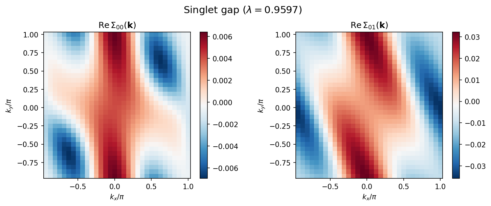
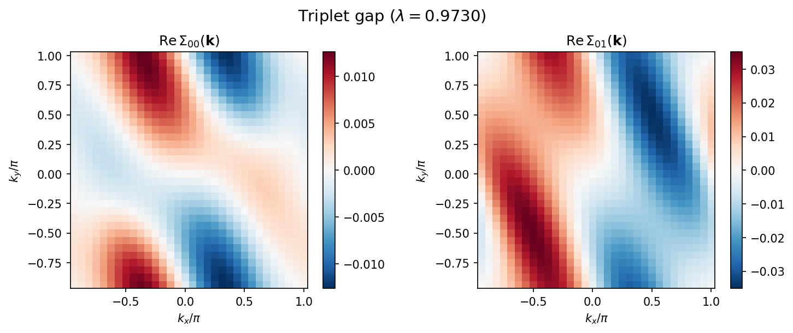
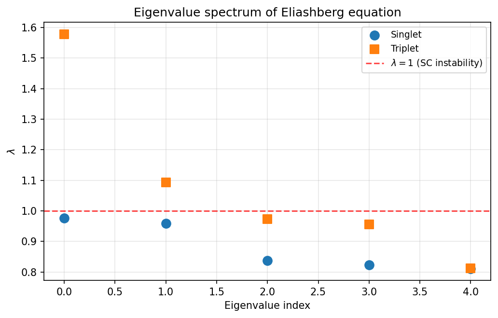

==========================================
Tutorial: Eliashberg equation solver
==========================================

This tutorial demonstrates how to use ``hwave_sc``,
the linearized Eliashberg equation solver included in H-wave.
The tool analyzes superconducting instabilities by computing
the leading eigenvalue of the linearized Eliashberg equation
using the bare susceptibility :math:`\chi_0(\mathbf{q})` from H-wave's RPA solver.

The sample files for this tutorial are located in
``docs/en/source/rpa/sample_sc`` directory.

Overview of the workflow
----------------------------

The calculation proceeds in two steps:

1. **RPA calculation** (``hwave``): Compute the bare susceptibility
   :math:`\chi_0(\mathbf{q})` and save it to ``chi0q.npz``.
2. **Eliashberg solver** (``hwave_sc``): Load ``chi0q.npz``, reconstruct
   the Green's function, compute RPA vertices, and solve the
   linearized Eliashberg equation.

Model
----------------------------

This tutorial uses a **two-orbital tight-binding model** on a
two-dimensional square lattice at 3/4 filling.
The Hamiltonian is:

.. math::

   H = \sum_{\mathbf{k},\alpha,\beta,\sigma}
       \varepsilon_{\alpha\beta}(\mathbf{k})\,
       c^\dagger_{\mathbf{k}\alpha\sigma} c_{\mathbf{k}\beta\sigma}
     + U \sum_{i,\alpha} n_{i\alpha\uparrow} n_{i\alpha\downarrow}
     + \sum_{i,\alpha\neq\beta} V_{\alpha\beta}\,
       n_{i\alpha} n_{i\beta}

with on-site Coulomb repulsion :math:`U = 0.4` and
inter-orbital Coulomb interaction :math:`V`.

This sample is based on the conduction layer model of the organic conductor
:math:`\beta`\ -(meso-DMBEDT-TTF)\ :math:`_2`\ PF\ :math:`_6`,
with transfer integrals obtained from extended Huckel calculations. [1]_

Theory
----------------------------

Superconducting susceptibility
^^^^^^^^^^^^^^^^^^^^^^^^^^^^^^^^

The RPA charge susceptibility :math:`\hat{X}^c` and spin susceptibility
:math:`\hat{X}^s` are given by:

.. math::

   \hat{X}^c = (\hat{I} + \hat{X}^{(0)} (\hat{U} + 2\hat{V}))^{-1} \hat{X}^{(0)}

.. math::

   \hat{X}^s = (\hat{I} - \hat{X}^{(0)} \hat{U})^{-1} \hat{X}^{(0)}

where :math:`\hat{X}^{(0)}` is the bare susceptibility,
:math:`\hat{U}` the on-site interaction matrix,
and :math:`\hat{V}` the inter-site interaction matrix.

Linearized Eliashberg equation
^^^^^^^^^^^^^^^^^^^^^^^^^^^^^^^^

The linearized Eliashberg equation for singlet superconductivity reads:

.. math::

   \lambda_S \Sigma^a_{\alpha\sigma;\beta\bar{\sigma}}(\mathbf{k})
   = -\frac{T}{N_L} \sum_{\mathbf{k}',n',\alpha',\beta'}
   P^S_{\alpha\sigma;\beta\bar{\sigma}}(\mathbf{k} - \mathbf{k}')
   G^{(0)}_{\alpha\alpha'}(\mathbf{k}', i\varepsilon_{n'})
   G^{(0)}_{\beta\beta'}(-\mathbf{k}', -i\varepsilon_{n'})
   \Sigma^a_{\alpha'\sigma;\beta'\bar{\sigma}}(\mathbf{k}')

The pairing interaction for the singlet channel is:

.. math::

   \hat{P}^S = \hat{U} + \hat{V}
   + \frac{3}{2} \hat{U} \hat{X}^s \hat{U}
   - \frac{1}{2} (\hat{U} + 2\hat{V}) \hat{X}^c (\hat{U} + 2\hat{V})

For the triplet channel:

.. math::

   \hat{P}^T = \hat{V}
   - \frac{1}{2} \hat{U} \hat{X}^s \hat{U}
   - \frac{1}{2} (\hat{U} + 2\hat{V}) \hat{X}^c (\hat{U} + 2\hat{V})

The superconducting transition corresponds to :math:`\lambda_S = 1`
(:math:`\lambda_T = 1` for triplet). When :math:`\lambda > 1`,
the normal state is unstable toward superconductivity.
Note that only positive eigenvalues indicate SC instability;
negative eigenvalues correspond to sign-changing gap functions
but do not satisfy the self-consistency condition :math:`\Delta = K\Delta`.

``hwave_sc`` implements two numerical methods to solve the Eliashberg equation:
self-consistent power iteration (converges to the mode with the largest eigenvalue)
and Arnoldi eigenvalue analysis.

.. [1] K. Yoshimi, M. Nakamura, and H. Mori,
   J. Phys. Soc. Jpn. **76**, 024706 (2007);
   `arXiv:cond-mat/0608466 <https://arxiv.org/abs/cond-mat/0608466>`_.

Prepare input files
----------------------------

Parameter file
^^^^^^^^^^^^^^^^^^^^^^^^^^^^^^^^

Create a TOML parameter file ``input.toml``:

.. literalinclude:: ../sample_sc/input.toml

The file contains the following sections:

``[mode.param]`` section
""""""""""""""""""""""""""""""""

- ``T``: Temperature.
- ``CellShape``: Size of the k-point mesh (32 x 32 x 1 for a 2D system).
- ``Nmat``: Number of Matsubara frequencies (512).
- ``filling``: Electron filling per orbital per spin (0.75 = 3/4 filling).

``[file]`` section
""""""""""""""""""""""""""""""""

- ``[file.input.interaction]``: Specifies files for geometry, transfer integrals,
  and interaction parameters. These files are shared with the RPA step.
- ``[file.output]``: Output directory and filenames for :math:`\chi_0(\mathbf{q})`
  and :math:`\chi(\mathbf{q})`.

``[eliashberg]`` section
""""""""""""""""""""""""""""""""

This section controls the Eliashberg solver. Key parameters:

- ``solver_mode``: ``"iteration"`` (self-consistent power iteration),
  ``"eigenvalue"`` (Arnoldi eigenvalue analysis), or ``"both"``.
- ``chi0q_mode``: ``"load"`` reads :math:`\chi_0(\mathbf{q})` from the RPA output
  file; ``"calc"`` computes it internally; ``"flex"`` reads the dressed
  susceptibilities from a FLEX run (required for ``frequency = "dynamic"``).
- ``frequency``: pairing-vertex frequency treatment. ``"static"`` (default)
  evaluates the pairing vertex at zero bosonic frequency (the Nakano--Kuroki
  Eq. 9 static approximation) and gives a frequency-independent gap.
  ``"dynamic"`` solves the full Matsubara-frequency-dependent Eliashberg
  equation with a frequency-dependent pairing vertex
  :math:`V(\mathbf{q}, i\omega_l)` and gap :math:`\phi(\mathbf{k}, i\omega_n)`;
  it requires ``chi0q_mode = "flex"`` (see
  :ref:`the dynamic-frequency section <sc_dynamic_frequency>` below).
- ``pairing_type``: ``"singlet"`` or ``"triplet"``.
- ``init_gap``: Initial gap symmetry for iteration.
  Options include ``"cos"`` (:math:`\cos(k_x+k_y+k_z)`),
  ``"d_x2y2"`` (:math:`\cos k_x - \cos k_y`), ``"random"``, etc.
  The full set of valid form factors is
  ``"cos"``, ``"s"``, ``"s_ext"``, ``"s_ext_2d"``, ``"d_x2y2"``,
  ``"d_y2z2"`` (:math:`\cos k_y - \cos k_z`),
  ``"d_xy"``, ``"d_xz"``, ``"d_yz"``, ``"d_z2"``,
  ``"p_x"``, ``"p_y"``, ``"p_z"``, and ``"random"``.
  For a quasi-two-dimensional cell ``CellShape = [1, Ny, Nz]``
  (:math:`k_x = 0`) the seeds built from :math:`\sin k_x`
  (``"p_x"``, ``"d_xy"``, ``"d_xz"``) vanish identically; use
  ``"p_y"``/``"p_z"`` for the triplet channel, and ``"d_y2z2"`` — which has
  opposite-sign anti-nodes at :math:`(\pi,0)` and :math:`(0,\pi)`, unlike the
  nodal ``"d_yz"`` that vanishes there — for the in-plane :math:`d`-wave.
- ``max_iter``: Maximum number of self-consistent iterations.
- ``alpha``: Mixing parameter (0 = no mixing, 1 = full mixing of old solution).
- ``convergence_tol``: Convergence criterion on the gap function.
- ``num_eigenvalues``: Number of eigenvalues to compute in eigenvalue mode.
- ``eigenvalue_method``: ``"arnoldi"`` (default), ``"subspace"``, or
  ``"shift-invert-gmres"`` / ``"shift-invert-bicgstab"`` / ``"shift-invert-lgmres"``.
- ``sigma_shift`` (shift-invert ``eigenvalue_method`` only): the real target
  :math:`\sigma` for the shift-invert eigensolver; eigenvalues near
  :math:`\sigma` are found first. Ignored (with a warning) for the plain
  ``"arnoldi"`` method -- use ``spectral_shift`` there instead.
- ``spectral_shift`` (``eigenvalue_method = "arnoldi"`` only): a positive number,
  or ``"auto"``. The default ARPACK selection (``which='LM'``) returns the
  eigenvalues of largest *magnitude*; far from a pairing instability, a small
  positive (attractive) leading eigenvalue can be masked by much larger negative
  (repulsive) eigenvalues, so the reported leading value comes out negative and
  unphysical. Setting ``spectral_shift`` makes the solver request the eigenvalue
  of largest *real* part (``which='LR'``; the physical SC eigenvalue,
  :math:`\lambda \to 1` at :math:`T_c`) on the shifted operator
  :math:`A + \sigma I`; the shift is subtracted internally, so the eigenvalues
  you receive/save are the true unshifted ones. Use ``"auto"`` to set
  :math:`\sigma` from the spectral radius automatically, or give an explicit
  positive :math:`\sigma` larger than the *absolute value* of the most negative
  eigenvalue (so :math:`A + \sigma I` has an all-positive-real spectrum).
  Recommended whenever the leading eigenvalue comes out negative or you scan
  weakly-pairing systems (low pressure, quasi-1D). Note this differs from
  ``sigma_shift`` above (a shift-invert *target*, not a spectral shift).
- ``gpu``: Set ``true`` to run the dynamic-mode (``frequency = "dynamic"``)
  kernel applications on a GPU via CuPy (default ``false``; see the
  :ref:`GPU section <sc_dynamic_gpu_en>` below).
- ``gpu_required``: Set ``true`` to make ``gpu = true`` strict -- the solver
  raises instead of silently falling back to CPU when CuPy/CUDA is unavailable
  (default ``false``). Honored by the dynamic Eliashberg solver (set it in
  ``[eliashberg]``) and by the FLEX and RPA solvers (set it in
  ``[mode.param]``, alongside their ``gpu`` flag).
- ``fft_workers``: Number of FFT worker threads for the dynamic-mode spatial
  FFTs (default ``1`` = the serial numpy path, unchanged from previous
  releases; ``-1`` uses all cores; ignored on the GPU).
- ``matsubara_basis``: Matsubara-axis representation of the dynamic mode:
  ``"uniform"`` (default, unchanged) or ``"ir"`` (the sparse-ir intermediate
  representation; see :ref:`the IR section <sc_dynamic_ir_en>` below).
- ``ir_tol``: IR basis cutoff accuracy (default 1e-8).
- ``ir_wmax``: real-frequency bandwidth of the IR basis, in the same energy
  units as the Hamiltonian (auto-estimated from the dispersion spectral range
  ``max|eps_k - mu|`` and the interaction scale when omitted; if the estimate
  cannot be formed, the solver fails fast and asks for an explicit value).
- ``ir_keep_static_chi``: ``true`` / ``false`` (default ``false``). When the
  spin/charge susceptibility is static-dominated (large and nearly frequency-
  independent within the sampled window, i.e. the near-critical regime), the
  frequency-independent component the IR compression would otherwise discard as
  the small :math:`O(\beta/N_\mathrm{mat})` :math:`\delta(\tau)` artifact instead
  carries physical weight; dropping it corrupts the leading eigenvalue. If that discarded
  component exceeds the data scale the solver aborts with guidance. Set this to
  ``true`` to retain the static component instead of aborting (alternatively
  lower ``ir_wmax`` or increase the FLEX ``Nmat``).

Interaction definition files
^^^^^^^^^^^^^^^^^^^^^^^^^^^^^^^^

The interaction definition files use the Wannier90-like format,
shared with the RPA solver. See :ref:`Ch:Config_rpa` for details.

``Geometry`` (``geom.dat``):

.. literalinclude:: ../sample_sc/geom.dat

Defines a unit cell with 2 orbitals.

``Transfer`` (``transfer.dat``):

.. literalinclude:: ../sample_sc/transfer.dat

Defines the hopping integrals for the two-orbital model.

``CoulombIntra`` (``coulombintra.dat``):

.. literalinclude:: ../sample_sc/coulombintra.dat

On-site Coulomb repulsion :math:`U = 0.4` on each orbital.

``CoulombInter`` (``coulombinter.dat``):

.. literalinclude:: ../sample_sc/coulombinter.dat

Inter-orbital and inter-site Coulomb interactions.

Step 1: Run RPA calculation
----------------------------

First, compute the bare susceptibility by running the RPA solver:

.. code-block:: bash

    $ hwave input.toml

This generates ``output/chi0q.npz`` and ``output/chiq.npz``.
The RPA step takes a few seconds for a 32 x 32 mesh.

Step 2: Run Eliashberg solver
---------------------------------

Next, run the Eliashberg equation solver using the same input file:

.. code-block:: bash

    $ hwave_sc input.toml

The solver performs the following steps:

1. Loads :math:`\chi_0(\mathbf{q})` from ``output/chi0q.npz``.
2. Reads the interaction files and builds the Hamiltonian.
3. Constructs the non-interacting Green's function :math:`G(\mathbf{k}, i\omega_n)`.
4. Computes the RPA charge and spin vertices
   :math:`V_c(\mathbf{q})` and :math:`V_s(\mathbf{q})`.
5. Solves the linearized Eliashberg equation by self-consistent
   iteration and/or eigenvalue analysis.

The output log shows the iteration progress:

.. code-block:: text

    hwave_sc: === Self-consistent iteration ===
    hwave_sc: Iteration    0: eigenvalue = 0.924446, diff = 3.544353e-01
    hwave_sc: Iteration    1: eigenvalue = 0.817270, diff = 7.893848e-02
    ...
    hwave_sc: Iteration  192: eigenvalue = 0.959725, diff = 9.900091e-06
    hwave_sc: Converged at iteration 193
    hwave_sc: Iteration result: eigenvalue = 0.959725, converged = True, n_iter = 193

followed by the eigenvalue analysis:

.. code-block:: text

    hwave_sc: === Eigenvalue analysis ===
    hwave_sc: Leading eigenvalues:
    hwave_sc:     0: 0.959725 (|ev| = 0.959725)
    hwave_sc:     1: 0.836778 (|ev| = 0.836778)
    hwave_sc:     2: 0.810959 (|ev| = 0.810959)
    hwave_sc:     3: -0.887954 (|ev| = 0.887954)
    hwave_sc:     4: -1.071303 (|ev| = 1.071303)
    hwave_sc:     5: -1.349775 (|ev| = 1.349775)
    hwave_sc:     6: 0.976353 (|ev| = 0.976353)  [opposite-parity sector]
    hwave_sc:     7: 0.823774 (|ev| = 0.823774)  [opposite-parity sector]
    ...

An eigenvalue :math:`\lambda > 1` (positive) indicates a superconducting instability
at the given temperature. Negative eigenvalues correspond to sign-changing gap symmetries
but do not indicate SC instability.

The eigenpairs are ordered so that those with the **channel parity** come first
(even for singlet, odd for triplet): the leading one (index 0) is the physical
solution and matches the self-consistent iteration result. Eigenvalues tagged
``[opposite-parity sector]`` belong to the other parity sector; for a given
spin channel they are forbidden by the Pauli principle and do **not** represent
a physical instability (see the note on parity below). The last column of
``eigenvalue.dat`` records this as ``match`` (``1`` = channel parity, ``0`` =
spurious).

Results
----------------------------

Gap function
^^^^^^^^^^^^^^^^^^^^^^^^^^^^^^^^

The following figures show the gap function :math:`\Sigma_{\alpha\beta}(\mathbf{k})`
in momentum space obtained from the self-consistent iteration.

**Singlet channel** (:math:`\lambda \approx 0.96`):

   Singlet gap function in k-space. Left: intra-orbital component
   :math:`\mathrm{Re}\,\Sigma_{00}(\mathbf{k})`.
   Right: inter-orbital component :math:`\mathrm{Re}\,\Sigma_{01}(\mathbf{k})`.
   The inter-orbital component is about 5 times larger than the intra-orbital one,
   indicating that inter-orbital pairing is dominant.

**Triplet channel** (:math:`\lambda \approx 0.97`):

   Triplet gap function in k-space. Left: intra-orbital component
   :math:`\mathrm{Re}\,\Sigma_{00}(\mathbf{k})`.
   Right: inter-orbital component :math:`\mathrm{Re}\,\Sigma_{01}(\mathbf{k})`.
   The gap is **odd** under :math:`\mathbf{k} \to -\mathbf{k}` (with the orbital
   transpose), as required for spin-triplet pairing; the inter-orbital component
   is again the larger one.

Eigenvalue spectrum
^^^^^^^^^^^^^^^^^^^^^^^^^^^^^^^^

The eigenvalue spectrum of the linearized Eliashberg equation is shown below
for both singlet and triplet channels.

   Positive eigenvalue spectrum :math:`\lambda` of the linearized Eliashberg equation.
   The dashed red line indicates :math:`\lambda = 1` (SC instability criterion).
   Filled markers are the **physical** eigenvalues (the gap has the channel
   parity: even for singlet, odd for triplet); open markers are **spurious**
   opposite-parity modes. All physical eigenvalues lie below 1. The two open
   markers above 1 are even-parity solutions of the *triplet* kernel, which the
   Pauli principle forbids for spin-triplet pairing (see the parity note below).

The Arnoldi eigenvalue analysis finds multiple eigenvalues.
The figure shows only positive eigenvalues, which are relevant for the
SC instability criterion :math:`\lambda = 1`.
For the singlet channel, the leading **physical** (even-parity) eigenvalue is
:math:`\lambda_S \approx 0.96 < 1`, matching the self-consistent iteration
result, so there is no singlet SC instability at this temperature.

For the triplet channel, the leading **physical** (odd-parity) eigenvalue is
:math:`\lambda_T \approx 0.97 < 1`. The larger values near :math:`1.58` and
:math:`1.09` that appear in the triplet calculation are even-parity (spurious)
modes and are **not** triplet instabilities. The two physical channels are thus
very close (:math:`\lambda_T \gtrsim \lambda_S`), placing this temperature near
the singlet--triplet crossover; the actual SC transition (:math:`\lambda = 1`)
is reached at lower temperature.

Plotting script
^^^^^^^^^^^^^^^^^^^^^^^^^^^^^^^^

The above figures can be reproduced using the plotting script included
in the sample directory:

.. code-block:: bash

    $ python plot_results.py

Output files
----------------------------

The solver produces the following files in the ``output`` directory:

``gap.dat``
^^^^^^^^^^^^^^^^^^^^^^^^^^^^^^^^

The converged gap function :math:`\Delta_{\alpha\beta}(\mathbf{k})` in k-space.
Each line contains:

.. code-block:: text

    kx  ky  kz  Re(Δ_00)  Im(Δ_00)  Re(Δ_01)  Im(Δ_01)  Re(Δ_10)  Im(Δ_10)  Re(Δ_11)  Im(Δ_11)

where :math:`\alpha, \beta` are orbital indices.

``eigenvalue.dat``
^^^^^^^^^^^^^^^^^^^^^^^^^^^^^^^^

The eigenvalues of the linearized Eliashberg equation:

.. code-block:: text

    # Iteration eigenvalue
    9.59724792e-01
    # Eigenvalue analysis
    # index  Re(eigenvalue)  Im(eigenvalue)  |eigenvalue|  match(1=channel-parity)
       0  9.59725061e-01 -3.63739178e-12  9.59725061e-01 1
       1  8.36778019e-01 -3.64670431e-12  8.36778019e-01 1
       ...

The trailing ``match`` column is ``1`` when the eigenvector has the channel's
parity (a physical singlet/triplet gap) and ``0`` for a spurious opposite-parity
mode (see the parity note above). Older output files without this column are
read unchanged.

Physical interpretation
----------------------------

The leading eigenvalue :math:`\lambda` of the linearized Eliashberg equation
determines whether superconductivity emerges:

- :math:`\lambda > 1`: The normal state is unstable toward superconductivity.
  The corresponding eigenvector gives the symmetry of the gap function.
- :math:`\lambda < 1` (for all positive eigenvalues): The normal state is stable
  at this temperature.

Negative eigenvalues correspond to sign-changing gap functions
(such as :math:`s_\pm`-wave in multi-orbital systems),
but they do **not** indicate SC instability regardless of their magnitude.
The self-consistency condition :math:`\Delta = K\Delta` requires :math:`\lambda = 1`
(not :math:`\lambda = -1`).

By varying the temperature and finding the point where the largest
positive eigenvalue reaches :math:`\lambda = 1`, one can determine
the superconducting transition temperature :math:`T_c`.

In this example, at :math:`T = 0.1` both physical channels are just below the
instability threshold, with :math:`\lambda_S \approx 0.96` (singlet, even) and
:math:`\lambda_T \approx 0.97` (triplet, odd). They are nearly degenerate, with
the triplet marginally leading.

.. note::

   **Parity and the Pauli principle.**
   A Cooper pair must be antisymmetric under exchange of the two electrons,
   i.e. under the combined operation of spin exchange, orbital exchange, and
   :math:`\mathbf{k} \to -\mathbf{k}`. For an (even-frequency) gap
   :math:`\Sigma_{\alpha\beta}(\mathbf{k})` this fixes the spatial parity
   :math:`P:\ \Sigma_{\alpha\beta}(\mathbf{k}) \to \Sigma_{\beta\alpha}(-\mathbf{k})`:
   spin-singlet gaps are **even** (:math:`P = +1`) and spin-triplet gaps are
   **odd** (:math:`P = -1`). The Eliashberg kernel acts on the full gap space and
   is not restricted to one parity, so each channel's kernel also has
   opposite-parity eigenvectors. These are mathematical solutions with no
   physical meaning for that spin channel (e.g. an even-parity eigenvalue of the
   triplet kernel would be a totally symmetric pair state, forbidden by Pauli).
   ``hwave_sc`` therefore projects each self-consistent iterate onto the
   channel's parity sector, and the eigenvalue analysis labels each mode as
   physical (``match = 1``) or spurious (``match = 0``). The large values
   :math:`\lambda \approx 1.58,\ 1.09` seen in the triplet calculation are such
   spurious even-parity modes, **not** triplet instabilities.

Singlet vs. triplet comparison
^^^^^^^^^^^^^^^^^^^^^^^^^^^^^^^^

By changing ``pairing_type`` to ``"triplet"`` in the input file,
one can compare the singlet and triplet channels.
When switching to the triplet channel, ``init_gap`` must also be set to an
odd-parity (triplet) seed such as ``"p_x"`` (the ready-made
``input_triplet.toml`` does this); the default ``init_gap = "cos"`` is an even
(singlet) seed, and the solver now rejects a seed of the wrong parity with an
error rather than converging to an unphysical sector. Equivalently, omit
``init_gap`` entirely to let the solver pick the channel's parity automatically.
At :math:`T = 0.1` with the same parameters, the leading physical eigenvalues are
:math:`\lambda_T \approx 0.97` (triplet) and :math:`\lambda_S \approx 0.96`
(singlet): both are below 1, and the triplet marginally leads. This places the
sample near the singlet--triplet crossover of Ref. [1]_, where the triplet SC
state competes with the singlet for :math:`T > 0.05`, while the singlet SC
transition dominates at lower temperatures (:math:`T < 0.05`) due to the
enhancement of spin fluctuations. The actual transition
(:math:`\lambda = 1`) is reached on lowering the temperature.

.. _sc_dynamic_frequency:

Dynamic (frequency-dependent) Eliashberg equation
--------------------------------------------------

By default ``hwave_sc`` solves the Eliashberg equation in the **static
approximation**: the pairing vertex is evaluated at zero bosonic Matsubara
frequency (the Nakano--Kuroki Eq. 9 static approximation) and the gap
:math:`\Sigma(\mathbf{k})` carries no frequency dependence. Setting
``frequency = "dynamic"`` in the ``[eliashberg]`` section instead solves the
**full frequency-dependent** linearized Eliashberg equation,

.. math::

   \lambda\, \phi_{\alpha\beta}(\mathbf{k}, i\omega_n)
   = -\frac{T}{N_L} \sum_{\mathbf{k}', n'}
     V_{\alpha\beta}(\mathbf{k}-\mathbf{k}', i\omega_n - i\omega_{n'})\,
     [G G](\mathbf{k}', i\omega_{n'})\,
     \phi(\mathbf{k}', i\omega_{n'}),

keeping the full fermionic Matsubara axis of the gap
:math:`\phi(\mathbf{k}, i\omega_n)` together with a frequency-dependent pairing
vertex :math:`V(\mathbf{q}, i\omega_l)`. The vertex is applied as an
imaginary-time product (not as a static prefactor), so the kernel couples
different Matsubara frequencies.

FLEX prerequisite
^^^^^^^^^^^^^^^^^^^^^^^^^^^^^^^^

The dynamic mode needs frequency-resolved input that only the FLEX solver
produces, so it **must** be run with ``chi0q_mode = "flex"``. Before calling
``hwave_sc`` you must run a FLEX calculation (``mode = "FLEX"``) that writes,
into the directory read by the Eliashberg step:

- ``chiq_s.npz`` and ``chiq_c.npz`` -- the spin and charge susceptibilities on
  the **full** bosonic Matsubara axis (all ``Nmat`` frequencies), and
- ``green.npz`` -- the **dressed** Green's function
  :math:`G(\mathbf{k}, i\omega_n)`, from which the pair bubble is built.

.. note::

   The FLEX susceptibility files carry a ``chi_convention`` tag (``"kuroki"``
   for the reduced/squashed schemes, ``"myo"`` for the general full-vertex
   scheme) that the Eliashberg loader uses to interpret their orbital layout.
   For **two-orbital** systems (``norb = 2``) the reduced spin-orbital
   dimension and the orbital-pair dimension coincide (both ``4``), so this tag
   is what distinguishes them. H-wave versions before this fix inferred the
   layout from shape alone and mislabeled a ``norb = 2`` reduced (kuroki) chi
   as orbital-pair, corrupting the pairing vertex; Eliashberg eigenvalues and
   gap functions for such runs are **corrected (and therefore change)** in this
   version. Single-orbital and general (myo) results are unaffected.

``Nmat`` must be even and must match between the FLEX output and the
``[mode.param]`` value. If ``frequency = "dynamic"`` is requested without
``chi0q_mode = "flex"``, with an odd ``Nmat``, or without a dressed
``green.npz``, the solver aborts with an explanatory error rather than falling
back silently. The FLEX output directory can be selected with
``[file.input] path_to_flex_output`` (default: the ``[file.output]``
directory), and the individual filenames overridden with the ``[eliashberg]``
keys ``flex_chi_s`` / ``flex_chi_c`` / ``flex_green``.

Outputs
^^^^^^^^^^^^^^^^^^^^^^^^^^^^^^^^

In addition to ``eigenvalue.dat`` (the leading :math:`\lambda`), the dynamic
mode writes:

``gap_dynamic.npz``
   The full frequency-resolved gap and its metadata. Keys:

   - ``gap``: complex array of shape ``(norb, norb, Nx, Ny, Nz, Nmat)`` --
     :math:`\phi_{\alpha\beta}(\mathbf{k}, i\omega_n)`.
   - ``iomega``: the centered fermionic Matsubara frequencies
     :math:`\omega_n = (2n + 1 - N_{\mathrm{mat}})\pi T`.
   - ``T``: temperature.
   - ``pairing_type``: ``"singlet"`` or ``"triplet"``.
   - ``frequency``: ``"dynamic"``.
   - ``eigenvalue``: the leading :math:`\lambda`.
   - ``axis_order``: ``"(orb1, orb2, kx, ky, kz, iomega)"``.
   - ``normalization``: the gauge convention -- the gap is L2-normalized over
     all components and its largest-magnitude component is rotated
     real-positive, so the stored gap is reproducible across runs and
     linear-algebra backends.

``gap.dat``
   A single-frequency slice of the gap at the lowest positive Matsubara
   frequency (index ``Nmat//2``), in the same column layout as the static
   ``gap.dat`` (``kx ky kz`` then ``Re``/``Im`` per orbital pair). Its first
   line is a ``#``-prefixed header carrying ``frequency=dynamic`` together with
   the slice index and its :math:`\omega_n`.

Channel-parity selection
^^^^^^^^^^^^^^^^^^^^^^^^^^^^^^^^

Like the static solver, the dynamic mode reports the leading eigenpair **of the
requested pairing channel**, not merely the algebraically largest eigenvalue.
Fermion antisymmetry fixes the combined parity of the gap under
:math:`\phi_{\alpha\beta}(\mathbf{k}, i\omega_n) \to
\phi_{\beta\alpha}(-\mathbf{k}, -i\omega_n)`: even for ``singlet`` (this admits
both a conventional even-frequency and an odd-frequency singlet) and odd for
``triplet``. The Arnoldi eigenpairs are reordered so that the channel-parity
mode leads, and the per-eigenvalue table in ``eigenvalue.dat`` carries the same
trailing ``match(1=channel-parity)`` column as the static output (``1`` in the
requested sector, ``0`` in the opposite one). If none of the ``num_eigenvalues``
computed eigenpairs lies in the requested sector, the solver warns and falls
back to the raw leading pair; increase ``num_eigenvalues`` or check
``pairing_type`` in that case. The power-iteration path (``solver_mode =
"iteration"``) likewise projects every iterate onto the channel sector when the
kernel commutes with parity (a centrosymmetric model); if it does not, the
projection is disabled with a warning and the un-projected iteration is used.

Channel decomposition (diagnostic)
^^^^^^^^^^^^^^^^^^^^^^^^^^^^^^^^^^^^

The singlet pairing vertex is a sum of a spin-fluctuation, a charge-fluctuation,
and an instantaneous bare term,

.. math::

   V = \tfrac{3}{2}\, \hat S\, \chi_{\mathrm s}\, \hat S
       - \tfrac{1}{2}\, \hat C\, \chi_{\mathrm c}\, \hat C
       + \tfrac{1}{2}(\hat S + \hat C),

which is linear in the spin (:math:`\chi_{\mathrm s}`) and charge
(:math:`\chi_{\mathrm c}`) susceptibilities. Two optional booleans in the
``[eliashberg]`` section zero one channel before the vertex is built, to
attribute the pairing strength to spin vs. charge fluctuations:

- ``zero_chi_c`` (default ``false``): zero :math:`\chi_{\mathrm c}`; the vertex
  keeps the spin-fluctuation term plus the bare term (spin channel).
- ``zero_chi_s`` (default ``false``): zero :math:`\chi_{\mathrm s}`; the vertex
  keeps the charge-fluctuation term plus the bare term (charge channel).

Setting both to ``true`` leaves only the instantaneous bare vertex. Both default
off, so a production run is unaffected, and each zeroed channel logs a warning.
These are **diagnostics**: the instantaneous bare
:math:`\tfrac{1}{2}(\hat S + \hat C)` term is retained in every case, and because
the linearized-gap eigenvalue problem is nonlinear in the vertex, the
eigenvalues from separately zeroed runs are **not additive**
(:math:`\lambda_{\mathrm s} + \lambda_{\mathrm c} \neq \lambda_{\mathrm{full}}`
in general).

Eigenvector continuation (``seed_eigenvector``)
^^^^^^^^^^^^^^^^^^^^^^^^^^^^^^^^^^^^^^^^^^^^^^^^^^

The reported leading eigenpair is normally the algebraically largest one. For a
frequency-dependent (non-Hermitian) kernel this can be fragile near an
*exceptional point* — where two real eigenvalues collide and split into a
complex-conjugate pair — so the "leading" branch may jump discontinuously
between neighbouring temperatures even when the FLEX self-energy varies
smoothly. To follow one physical branch, set ``[eliashberg] seed_eigenvector``
to a ``gap_dynamic.npz`` written by a neighbouring run (e.g. the next-higher
temperature): its gap is used as the ARPACK start vector **and** to select the
eigenpair whose eigenvector maximally overlaps it, rather than the largest one.
Stepping temperature down and feeding each run the previous ``gap_dynamic.npz``
tracks the same gap symmetry (e.g. the d-wave mode) continuously. The seed must
share the run's ``CellShape`` and ``Nmat`` (a mismatch is a fail-fast error), so
keep ``Nmat`` fixed across a continuation sweep; on the IR path the seed gap is
refit onto the IR nodes automatically. ``[eliashberg] sigma_shift`` sets an
explicit shift-invert target (otherwise estimated from a preliminary Arnoldi);
combining ``sigma_shift`` near the branch with ``seed_eigenvector`` is the most
robust way to resolve a masked or complexifying eigenvalue.

Temperature continuation (``hwave_tsweep``)
^^^^^^^^^^^^^^^^^^^^^^^^^^^^^^^^^^^^^^^^^^^^^^^^^^^^^^^^^^^

Chaining ``sigma_init`` and ``seed_eigenvector`` by hand across a temperature
sweep, as described above, means re-running ``hwave``/``hwave_sc`` once per
temperature and wiring each step's output into the next step's input. The
``hwave_tsweep`` command (installed alongside ``hwave`` and ``hwave_sc``)
automates this: given one base TOML -- the same
``[mode]``/``[mode.param]``/``[file]``/``[eliashberg]`` configuration used
for a single FLEX+Eliashberg run -- plus a ``[continuation]`` section, it
runs FLEX (and, unless disabled, the Eliashberg solver) across a descending
ladder of temperatures. At each rung it feeds the previous rung's converged
self-energy into this rung's FLEX via ``sigma_init`` (warm start) and the
previous rung's dynamic gap into this rung's Eliashberg solve via
``seed_eigenvector`` (eigenvector continuation) -- automating the whole
warm-start chain so a single physical branch is tracked smoothly down to low
temperature instead of being cold-started, and potentially landing on a
different metastable solution, at every point.

Only ``mode.param.T`` is varied between rungs; ``CellShape``, ``Nmat``, and
every other shape-determining field are held fixed across the ladder, which
is what keeps each rung's ``sigma_init``/``seed_eigenvector`` files
shape-compatible with the next rung.

The ``[continuation]`` section
""""""""""""""""""""""""""""""

.. code-block:: toml

    [continuation]
      temperatures   = [0.02, 0.015, 0.01, 0.008, 0.006]  # explicit ladder
      # or, if `temperatures` is absent, a generated ladder:
      #   T_start = 0.02
      #   T_stop  = 0.006
      #   num     = 5
      #   spacing = "linear"          # "linear" (default) or "log"
      output_dir     = "tsweep"       # default
      run_eliashberg = true           # default
      warm_start     = true           # default
      seed_gap       = true           # default
      resume         = false          # default; or pass --resume
      summary_file   = "lambda_vs_T.dat"  # default

- ``temperatures``: an explicit list of temperatures, run in the order given.
  If present it takes precedence over ``T_start``/``T_stop``/``num``.
- ``T_start`` / ``T_stop`` / ``num`` / ``spacing``: used to generate the
  ladder when ``temperatures`` is absent -- ``num`` points between
  ``T_start`` and ``T_stop``, with ``spacing`` ``"linear"`` (default) or
  ``"log"``. Supplying neither ``temperatures`` nor the ``T_start``/``T_stop``/``num``
  triple is a pre-flight error.
- ``output_dir`` (default ``"tsweep"``): the parent directory for the sweep.
  Rung ``idx`` at temperature ``T`` writes to
  ``<output_dir>/<idx>_T<T>/output/`` (``idx`` zero-padded to 3 digits, ``T``
  ``%g``-formatted).
- ``run_eliashberg`` (default ``true``): also run the Eliashberg solver at
  each rung. This requires the base TOML to already have an ``[eliashberg]``
  section -- pre-flight raises an error otherwise, naming the missing
  section. Set to ``false`` to run a FLEX-only sweep that chains only
  ``sigma_init``.
- ``warm_start`` (default ``true``): chain each rung's converged self-energy
  into the next rung's ``sigma_init``.
- ``seed_gap`` (default ``true``): chain each rung's gap into the next
  rung's ``seed_eigenvector``. This is only active for the dynamic
  Eliashberg solver (``[eliashberg] frequency = "dynamic"``); for a static
  ladder it has no effect, since ``seed_eigenvector`` itself is dynamic-only.
- ``summary_file`` (default ``"lambda_vs_T.dat"``): filename of the summary
  table written to ``<output_dir>/<summary_file>``.

Running the sweep
""""""""""""""""""""""""""""""

.. code-block:: bash

    $ hwave_tsweep input.toml

Three flags control the run:

- ``--dry-run``: resolve and print the temperature ladder, each rung's
  output directory, and the ``sigma_init``/``seed_eigenvector`` paths that
  would be wired up -- without invoking either solver. Use this to validate
  a ``[continuation]`` config before committing to a long sweep.
- ``--keep-going``: by default a rung whose solver raises an error stops the
  sweep (a broken rung would otherwise poison every downstream seed, and the
  partial summary is still written); with ``--keep-going`` the next rung is
  instead cold-started, and if it succeeds it becomes the seed for
  subsequent rungs again. This is *error continuation within one process*,
  not a restart after the process itself was interrupted.
- ``--resume`` (or ``[continuation] resume = true``): *job-level restart*.
  When a sweep is rerun with resume, ``hwave_tsweep`` skips the longest
  contiguous prefix of already-completed, seedable rungs and restarts at the
  first incomplete one -- seeded from the last valid rung's ``sigma`` and
  dynamic gap, exactly as if the sweep had never stopped. Use it after a
  wall-clock/scheduler kill, a crash, or a manual interrupt.

  A rung counts as completed only when its recorded summary row is non-error
  **and** its on-disk outputs are actually present and parseable (a
  half-written or corrupt ``eigenvalue.dat`` is detected and that rung, plus
  every rung after it, is recomputed). Resume is guarded by a small manifest
  (``tsweep_manifest.json``, written on the first run) recording the resolved
  ladder and a fingerprint of the shape/physics configuration
  (``CellShape``/``SubShape``/``Nmat``/``filling``/``Ncond``/interaction
  files/``[eliashberg]`` frequency/pairing). Resuming against a different
  ladder or configuration **fails fast** rather than mixing incompatible
  results. The summary and manifest are written atomically after every rung,
  so an interruption can never leave a truncated checkpoint. Without
  ``--resume`` a rerun starts fresh and overwrites the existing sweep
  rung-by-rung (a warning is logged when it detects an existing sweep).

The three are distinct: **warm start** (``warm_start``/``seed_gap``) chains
one rung's result into the *next* rung's seed within a single run;
**--keep-going** decides what happens *after a rung errors* within one run;
**--resume** decides what happens when a *whole run* is restarted.

Summary file
""""""""""""""""""""""""""""""

Each run writes ``<output_dir>/<summary_file>`` (default
``tsweep/lambda_vs_T.dat``), one row per rung:

.. code-block:: text

    # idx  T  status  error_stage  Re_lambda  Im_lambda  parity_match  flex_converged  flex_iter
    0 0.02   ok    none 0.845000 0.000000 1 1 18
    1 0.015  ok    none 0.902000 0.000000 1 1 22
    2 0.01   error flex nan      nan      -1 0 -1
    ...

``status`` is one of:

- ``ok`` -- FLEX converged and, if ``run_eliashberg``, the leading eigenpair
  was parsed from this rung's ``eigenvalue.dat``.
- ``not_converged`` -- FLEX ran to ``IterationMax`` without meeting ``EPS``,
  but still wrote a usable self-energy (and gap, if Eliashberg ran); such a
  rung is still eligible to seed the next one.
- ``error`` -- a solver raised, or (with ``run_eliashberg``) ``eigenvalue.dat``
  was missing or unparseable; ``error_stage`` then records which solver
  failed (``flex`` or ``eliashberg``).
- ``dry`` -- a row produced by ``--dry-run``; no solver was invoked.

Missing floats (``Re_lambda``/``Im_lambda`` when Eliashberg did not run or
failed) print as ``nan``; missing integer fields (``parity_match``,
``flex_converged``, ``flex_iter``) print as ``-1``. ``error_stage`` is
``none`` unless ``status = error``.

Example
""""""""""""""""""""""""""""""

.. code-block:: toml

    [mode]
      mode = "FLEX"

    [mode.param]
      T         = 0.02
      CellShape = [32, 32, 1]
      Nmat      = 512
      filling   = 0.75

    [file]
    [file.input]
      path_to_input = "."

    [file.input.interaction]
      path_to_input = "."
      Geometry      = "geom.dat"
      Transfer      = "transfer.dat"
      CoulombIntra  = "coulombintra.dat"
      CoulombInter  = "coulombinter.dat"

    [file.output]
      path_to_output = "output"

    [eliashberg]
      frequency     = "dynamic"
      chi0q_mode    = "flex"
      pairing_type  = "singlet"
      solver_mode   = "eigenvalue"   # required by hwave_tsweep pre-flight

    [continuation]
      T_start        = 0.02
      T_stop         = 0.005
      num            = 6
      spacing        = "log"
      run_eliashberg = true
      warm_start     = true
      seed_gap       = true

This descends from :math:`T = 0.02` to :math:`T = 0.005` over 6
log-spaced rungs, running FLEX + dynamic Eliashberg at each, chaining both
``sigma_init`` and ``seed_eigenvector``, and writing
``tsweep/lambda_vs_T.dat`` -- a :math:`\lambda(T)` table from which
:math:`T_c` can be estimated as the point where the leading physical
eigenvalue crosses 1.

Memory note
^^^^^^^^^^^^^^^^^^^^^^^^^^^^^^^^

The dynamic solver stores several full-frequency tensors (the pairing vertex,
the pair bubble, and the gap), so its peak memory scales roughly as
:math:`\mathcal{O}(N_{\mathrm{orb}}^4\, N_k\, N_{\mathrm{mat}})` and grows
quickly with the orbital count, k-mesh, and number of Matsubara frequencies.
Before allocating, ``hwave_sc`` estimates the peak requirement and aborts if it
would exceed the limit; set ``[eliashberg] mem_limit_gb`` to cap it explicitly
(``0`` disables the guard), otherwise a fraction of the available RAM is used.
The estimate reads the stored ``Nmat`` (the Matsubara-frequency axis) from the
on-disk file headers (``chiq_s.npz`` / ``chiq_c.npz`` / ``green.npz``) rather
than trusting only the configured value, so a file whose stored ``Nmat`` differs
from the configuration is rejected up front (before allocation) instead of
causing an out-of-memory crash mid-load. (The k-mesh and orbital count are taken
from the configuration; a mismatch there surfaces as a reshape error from the
loader.)

Performance note
^^^^^^^^^^^^^^^^^^^^^^^^^^^^^^^^

The eigenvalue solve is dominated by repeated applications of the kernel. Two
optimizations keep this cheap: the vertex's imaginary-time transform (the
kernel's most expensive step) is precomputed once instead of on every matvec,
and the spatial FFTs are run in parallel via ``scipy.fft``. ``[eliashberg]
fft_workers`` sets the number of FFT worker threads: ``1`` (default) keeps the
serial numpy path unchanged from previous releases, ``-1`` uses all cores
(opt-in); set a smaller number (e.g. matching ``OMP_NUM_THREADS``) when running
several dynamic solves concurrently to avoid oversubscribing the CPU. Together
these give roughly a 4x speedup at ``norb = 2``, ``N_k = 1024``,
``N_{mat} = 1024``. On the GPU (``gpu = true``) the FFTs already run on the
device and ``fft_workers`` is ignored.

.. _sc_dynamic_ir_en:

IR-basis (sparse-ir) compression of the Matsubara axis
^^^^^^^^^^^^^^^^^^^^^^^^^^^^^^^^^^^^^^^^^^^^^^^^^^^^^^^^

``matsubara_basis = "ir"`` replaces the dynamic mode's uniform Matsubara grid
(``Nmat`` points) by the sparse sampling nodes of the intermediate
representation (IR) basis -- typically 50-100 nodes, improving with lower
temperature. Requires the optional
`sparse-ir <https://sparse-ir.readthedocs.io>`_ package
(``pip install sparse-ir``). The kernel, the eigen-iteration, and the parity
filtering all run on the sparse nodes, cutting the frequency-axis memory and
compute by ``Nmat/L`` (20-40x). Note that ``Nmat`` keeps its role: the
preceding FLEX run still produces (and must converge on) the uniform
``Nmat`` grid that the IR loader reads, and the outputs below are densified
back onto it -- IR compresses the dynamic solver's INTERNAL frequency axis,
whose node count is set by ``beta * ir_wmax`` and ``ir_tol``, not by
``Nmat``. Composes with GPU execution (``gpu = true``, which still requires
CuPy; ``fft_workers`` keeps its meaning for the CPU spatial FFTs and is
ignored on the GPU).

Outputs (``gap_dynamic.npz`` / ``gap.dat``) are densified back to the uniform
grid, so downstream analysis works unchanged (the npz gains provenance
metadata such as ``matsubara_basis``).

When the FLEX run itself uses ``[mode.param] matsubara_basis = "ir"`` with
``write_densified = false`` (IR-native output files, recognizable by their
``frequency_grid = "sparse_ir_nodes"`` key), the dynamic solver with
``matsubara_basis = "ir"`` consumes them directly: the stored node values
are used as-is when the node sets coincide (the common case), or refit onto
this run's basis otherwise (logged, with a residual check). The temperature
must match the FLEX run (a mismatch is an error — the susceptibilities are
physics input). With ``matsubara_basis = "uniform"``, IR-native inputs are
rejected with an explicit error; either switch this solver to ``"ir"`` or
re-run FLEX with ``write_densified = true``.

.. note::

   FLEX outputs computed on the uniform FFT grid (``chiq_s.npz`` etc.) carry
   ``O(beta/Nmat)`` discretization artifacts (a delta(tau)-derived constant
   offset plus aliasing images). The IR loader isolates and discards the
   constant when it is small (logged); if the fitted constant is
   COMPARABLE to the data scale it cannot be the discretization artifact,
   and the run stops with an error instead of silently corrupting the
   result (remedies, also printed by the error: use the automatic
   ``ir_wmax`` or a value near ``3*(bandwidth + max interaction)``;
   increase the FLEX ``Nmat``; set ``ir_keep_static_chi = true`` to
   retain a genuinely static component; or fall back to
   ``matsubara_basis = "uniform"``). The eigenvalue difference between
   the IR and uniform paths is bounded by this input-data quality
   (measured ~1.5e-2 relative at ``Nmat=128`` and ~4e-3 at ``Nmat=512``
   on the small test fixture with the dispersion-based automatic
   ``ir_wmax``; these numbers are fixture-specific, not a general
   guarantee); both converge to the same continuum limit as ``Nmat``
   grows. For production use, validate once per model: raise the FLEX
   ``Nmat`` (or compare a uniform run against the IR run at the same
   ``Nmat``) and check that the leading eigenvalue shift is within your
   tolerance.

.. warning::

   Dynamic IR results computed with H-wave versions BEFORE the issue-#57
   fix are incorrect for any model whose pairing vertex has a nonzero
   frequency-independent part — in particular anything with off-site
   ``CoulombInter`` (pure on-site-``CoulombIntra`` models were
   unaffected: their bare vertex term cancels exactly). Recompute such
   runs; large changes in lambda are expected (they were the bug, not a
   physics change). The automatic ``ir_wmax`` estimate also changed to a
   dispersion-based bound and is now much smaller (and correct) on
   realistic multi-hopping models.

.. _sc_dynamic_gpu_en:

GPU execution (CuPy)
^^^^^^^^^^^^^^^^^^^^^^^^^^^^^^^^

Setting ``gpu = true`` in the ``[eliashberg]`` section runs the dynamic-mode
kernel applications (the eigensolver's matvec) on a GPU. The two large
invariant tensors (the pair bubble :math:`[GG]` and the pairing vertex) are
moved to the device once before the iteration starts; each iteration then only
transfers the gap vector. The result is numerically identical to the CPU run
(within double-precision round-off).

- Applies to ``frequency = "dynamic"`` only. The static solver is CPU-only, so
  setting ``gpu = true`` with ``frequency = "static"`` (or omitted, which
  defaults to static) fails fast with a ``ValueError`` rather than silently
  ignoring the flag.
- Requires `CuPy <https://cupy.dev/>`_ and a usable CUDA device. When CuPy is
  missing or no device is found, the solver warns and falls back to the CPU
  (numpy) path automatically -- same result, only slower.
- ``gpu_required = true`` (default ``false``) turns the silent CPU fallback
  into a hard error: if ``gpu = true`` is requested but no usable CuPy/CUDA
  backend exists, the solver raises instead of quietly running on the CPU, so
  a large scheduler job fails fast rather than turning a short GPU run into a
  very long CPU run. The same flag is honored by the FLEX and RPA solvers.
- Before the large device allocation, the FLEX and RPA GPU paths run an
  advisory VRAM preflight: if the estimated resident tensors exceed the free
  device memory, they log a warning naming the solver and the estimated/free
  amounts (CuPy still raises a hard out-of-memory error on the actual
  allocation).
- The GPU memory requirement is roughly the two resident tensors,
  :math:`2 \times 16\, N_{\mathrm{orb}}^4\, N_k\, N_{\mathrm{mat}}` bytes,
  plus workspace; if it does not fit, CuPy aborts with an explicit
  out-of-memory error.
- Reference point: :math:`N_{\mathrm{orb}}=2`, a :math:`64\times 64` k-mesh,
  and :math:`N_{\mathrm{mat}}=2048` give roughly a 16x per-matvec speedup over
  the CPU path (NVIDIA RTX 6000 Ada, about 5 GB of GPU memory).

Supported interactions
----------------------------

The Eliashberg solver supports all interaction types available in H-wave:

- ``CoulombIntra`` (:math:`U`): Intra-orbital Coulomb repulsion
- ``CoulombInter`` (:math:`V`): Inter-orbital Coulomb repulsion
- ``Hund`` (:math:`J`): Hund's coupling
- ``Exchange`` (:math:`J'`): Pair-hopping (exchange)
- ``Ising`` (:math:`I`): Ising-type spin interaction
- ``PairHop`` (:math:`P`): Pair hopping

For systems with ``Hund``, ``Exchange``, ``Ising``, or ``PairHop``
interactions, the solver automatically uses the generalized
:math:`S`/:math:`C` matrix formulation (Kuroki et al., PRB 79, 224511)
with four-index vertex structure.

Tips
----------------------------

- For large systems, set ``chi0q_mode = "calc"`` to compute
  :math:`\chi_0(\mathbf{q})` internally and avoid loading
  a large file.
- The ``"arnoldi"`` eigenvalue method is fastest for finding
  a few leading eigenvalues. For degenerate eigenvalues,
  ``"subspace"`` may be more robust.
- Different ``init_gap`` symmetries can be used to target
  specific pairing channels in iteration mode.
  The eigenvalue mode finds all leading symmetries automatically.
- The ``pairing_type = "triplet"`` option analyzes triplet
  pairing instabilities using the appropriate vertex.
