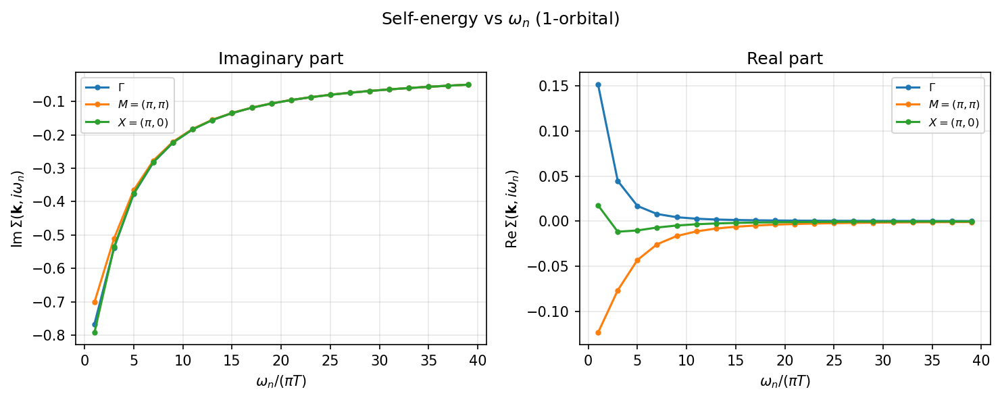
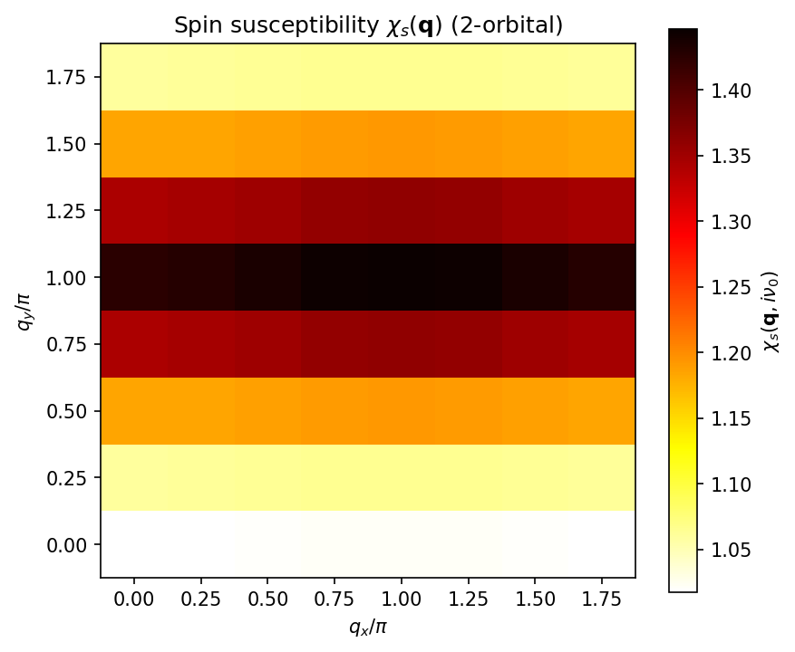
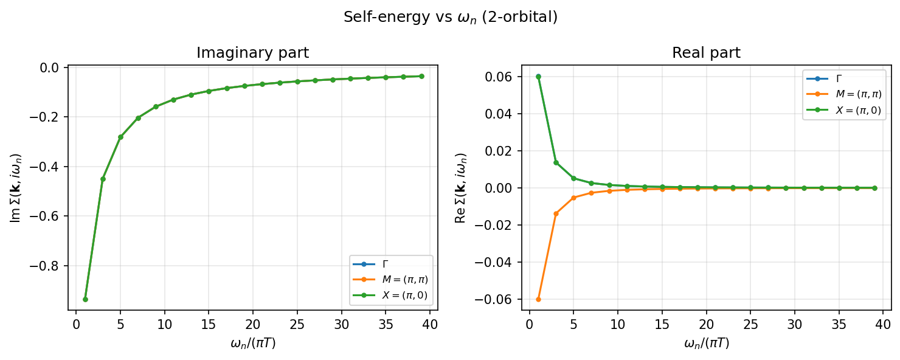
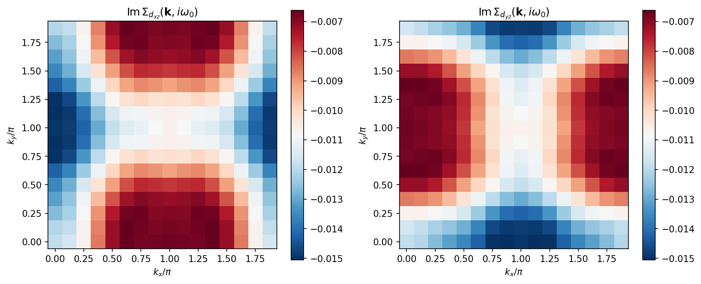
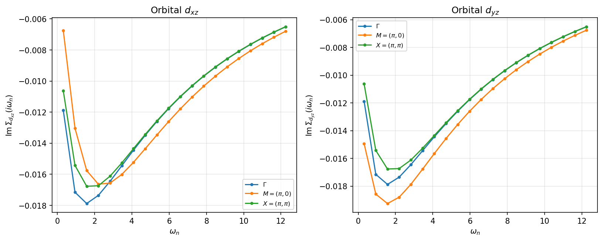

==========================================
チュートリアル: FLEXソルバー
==========================================

本チュートリアルでは、H-waveのFLEX
(Fluctuation Exchange Approximation; ゆらぎ交換近似) ソルバーの使い方を
説明します。FLEXはRPAを拡張し、裸のグリーン関数の代わりに
ドレスド（自己無撞着な）グリーン関数を用いることで、
相関電子系のより正確な記述を提供します。

サンプルファイルは ``docs/ja/source/flex/sample`` ディレクトリにあります。

概要
----------------------------

FLEX近似 [1]_ は遍歴電子系のための自己無撞着ダイアグラム法です。
裸のグリーン関数 :math:`G_0` を用いるRPAと異なり、
FLEXは以下の自己無撞着ループを収束まで繰り返します:

1. Dyson方程式からドレスドグリーン関数 :math:`G(\mathbf{k}, i\omega_n)` を計算
2. ドレスド :math:`G` から裸感受率 :math:`\chi_0(\mathbf{q}, i\nu_m)` を計算
3. 相互作用をスピンチャネルと電荷チャネルに分解
4. スピン/電荷感受率 :math:`\chi_s`, :math:`\chi_c` のRPA方程式を解く
5. 有効相互作用 :math:`V_{\mathrm{eff}}` を構成
6. FFT畳み込みにより自己エネルギー :math:`\Sigma(\mathbf{k}, i\omega_n)` を計算
7. 収束判定; 未収束なら1に戻る

.. note::

   電子数を ``filling`` / ``Ncond`` で固定する場合（``mu`` を固定しない場合）、FLEX
   は各SCF反復で化学ポテンシャル :math:`\mu` を*ドレスされた*Green関数から解き直し、
   自己エネルギーが成長しても目標フィリングが自己無撞着に保たれるようにします。この
   ため各反復で ``FLEX._find_mu_dressed: mu = ...`` の行が出力され、収束した
   :math:`\mu`（および正確な反復回数）は :math:`\mu` を非相互作用値に固定した計算とは
   異なります。本チュートリアルに示す反復回数・収束値はすべて例示であり、バージョンや
   環境によって多少変わり得ます。

理論
----------------------------

ドレスドグリーン関数
^^^^^^^^^^^^^^^^^^^^^^^^^^^^^^^^

ドレスドグリーン関数はDyson方程式から得られます:

.. math::

   G(\mathbf{k}, i\omega_n)
   = \left[ G_0^{-1}(\mathbf{k}, i\omega_n) - \Sigma(\mathbf{k}, i\omega_n) \right]^{-1}

ここで :math:`G_0^{-1}(\mathbf{k}, i\omega_n) = i\omega_n + \mu - H_0(\mathbf{k})`
は裸のグリーン関数の逆です。

スピン・電荷感受率
^^^^^^^^^^^^^^^^^^^^^^^^^^^^^^^^

裸感受率はドレスドグリーン関数から計算されます:

.. math::

   \chi_0(\mathbf{q}, i\nu_m) = -\frac{T}{N_k} \sum_{\mathbf{k}, n}
   G(\mathbf{k}+\mathbf{q}, i\omega_n + i\nu_m)\, G(\mathbf{k}, i\omega_n)

スピン感受率と電荷感受率は:

.. math::

   \chi_s = \left[ I - \chi_0 \, U_s \right]^{-1} \chi_0

.. math::

   \chi_c = \left[ I + \chi_0 \, U_c \right]^{-1} \chi_0

ここで :math:`U_s`, :math:`U_c` は全相互作用ハミルトニアンから
分解されたスピンおよび電荷相互作用頂点です。
単一バンドHubbardモデルでは :math:`U_s = U_c = U` となります。

有効相互作用
^^^^^^^^^^^^^^^^^^^^^^^^^^^^^^^^

FLEX有効相互作用はスピンゆらぎと電荷ゆらぎを結合します [1]_:

.. math::

   V_{\mathrm{eff}}(\mathbf{q}, i\nu_m)
   = W \left[ \frac{3}{2}\chi_s
            + \frac{1}{2}\chi_c - \chi_0 \right] W

ここで :math:`W` は裸の相互作用頂点です。
:math:`\chi_0` は **1回だけ** 減算します。最低次では :math:`\chi_s = \chi_c = \chi_0`
となるため括弧内は :math:`\chi_0` に帰着し、:math:`V_{\mathrm{eff}} = W \chi_0 W`
（2次の :math:`U^2` バブル）を与えます。この1回の減算により、:math:`\chi_s` と
:math:`\chi_c` に含まれる二重計上された2次ダイアグラムが除去されます。

自己エネルギー
^^^^^^^^^^^^^^^^^^^^^^^^^^^^^^^^

自己エネルギーは実空間・虚時間での畳み込みにより計算されます:

.. math::

   \Sigma(\mathbf{r}, \tau) = V_{\mathrm{eff}}(\mathbf{r}, \tau) \cdot G(\mathbf{r}, \tau)

この要素ごとの（Hadamard）積はFFTを用いて効率的に評価されます。

.. _flex_scope:

近似の適用範囲
^^^^^^^^^^^^^^^^^^^^^^^^^^^^^^^^

FLEXは保存近似（Baym--Kadanoff近似）であり、自己エネルギーに対してRPA的な
粒子--空孔バブルおよびラダー級数を足し上げます。一方で、電子が三角形の
フェルミオンループを介して *2本* のゆらぎ伝播子に結合する
Aslamazov--Larkin (AL) 型および Maki--Thompson (MT) 型の頂点補正
（モード間結合）は **含みません**。これらの高次補正はFLEXの枠組みの外であり、
ここでは評価されません。2つのスピンゆらぎから生成される電荷・軌道ゆらぎが
重要となる場合（例：Onari--Kontaniの軌道ゆらぎ機構 [2]_）には効くことがあります。

またデフォルトの ``calc_scheme = "reduced"`` スキームでは、
スピン/電荷バーテックスを相互作用の密度--密度成分で構成します。
``Exchange`` と ``PairHop`` は密度--密度成分の頂点を **一切持たない** ため、
このスキームでは近似すらできません。``reduced`` でこれらを
与えると ``ValueError`` となり、``calc_scheme = "general"`` への切り替えが
案内されます（以前の開発版では警告付きで受理され、相互作用は無音で効果
ゼロになっていました）。``calc_scheme = "auto"`` は ``Exchange``/``PairHop``
がある場合、自動的に ``general`` を選択します。``PairLift`` はどのスキーム
でも受理されます：その粒子-正孔頂点は厳密にゼロであり、感受率チャネルから
落とすことは近似ではなく厳密です。
したがってこのスキームでの「FLEX」は *厳密ではなく*、密度--密度かつ
AL/MTを含まないゆらぎ交換近似のレベルである点に注意してください。

一方、 ``calc_scheme = "general"`` スキームでは、off-diagonalな完全な
Kanamori頂点を **保持** します。これはMochizuki--Yanase--Ogata (MYO) [3]_
（およびTakimoto--Hotta--Ueda (THU) [4]_ により裏付けられた）に従う
常磁性の完全頂点（full-vertex）の定式化です。MYO規約のもとで
行列形式のスピン相互作用行列 :math:`\hat{U}^s` と
電荷相互作用行列 :math:`\hat{U}^c` を構成し、行列形式のRPA方程式を解いて
:math:`\chi_s`/:math:`\chi_c` を求め、ゆらぎ相互作用を
:math:`V = \tfrac{3}{2}\hat{U}^s\chi_s\hat{U}^s
+ \tfrac{1}{2}\hat{U}^c\chi_c\hat{U}^c
- \tfrac{1}{4}(\hat{U}^s+\hat{U}^c)\chi_0(\hat{U}^s+\hat{U}^c)`
として組み立てます。したがって ``"general"`` ではoff-diagonalの頂点は
**無視されず**、密度--密度縮約の警告も抑制されます。なお上記のAL/MT型の
頂点補正は、``"general"`` スキームにおいてもFLEXの枠組みの外にあります。

.. [1] N. E. Bickers and D. J. Scalapino,
   Ann. Phys. (N.Y.) **193**, 206 (1989).

.. [2] H. Kontani and S. Onari,
   Phys. Rev. Lett. **104**, 157001 (2010).

.. [3] M. Mochizuki, Y. Yanase, and M. Ogata,
   J. Phys. Soc. Jpn. (cond-mat/0407094).

.. [4] T. Takimoto, T. Hotta, and K. Ueda,
   Phys. Rev. B **69**, 104504 (2004); cond-mat/0309575.

サンプル 1: 1軌道Hubbardモデル
-----------------------------------------

モデル
^^^^^^^^^^^^^^^^^^^^^^^^^^^^^^^^

最初のサンプルは、二次元正方格子上のハーフフィリング (:math:`n = 1`)
における **1軌道Hubbardモデル** です。

.. math::

   H = -\sum_{\langle i,j \rangle, \sigma} t_{ij}\,
       c^\dagger_{i\sigma} c_{j\sigma}
     + U \sum_i n_{i\uparrow} n_{i\downarrow}

最近接ホッピング :math:`t = 1.0`、
次近接ホッピング :math:`t' = 0.5`、
オンサイトクーロン斥力 :math:`U = 4.0`、
温度 :math:`T = 0.5` を使用します。

このモデルは :math:`\mathbf{Q} = (\pi, \pi)` にピークを持つ
強い反強磁性 (AF) スピンゆらぎを示すことが知られています。

入力ファイルの準備
^^^^^^^^^^^^^^^^^^^^^^^^^^^^^^^^

サンプルファイルは ``docs/ja/source/flex/sample/1orb/`` にあります。

**パラメータファイル** (``input.toml``):

.. literalinclude:: ../sample/1orb/input.toml

主要パラメータ:

- ``mode = "FLEX"``: FLEXソルバーを選択
- ``T = 0.5``: 温度
- ``CellShape = [8, 8, 1]``: 2D系の 8 x 8 k点メッシュ
- ``Nmat = 64``: 松原周波数の数
- ``filling = 0.5``: 1サイトあたりの目標電子数（ハーフフィリング）。``filling``
  （または ``Ncond``）を指定すると、FLEX は各SCF反復でドレスドGreen関数から化学
  ポテンシャル :math:`\mu` を解き直し、自己エネルギーが成長してもフィリングを保存
  します。代わりに ``mu`` を指定した場合は固定されます。
- ``coeff_tail = 1.0``（省略可）: 松原和の高振動数テール加速係数。``coeff_tail = 1``
  は :math:`G` の厳密な :math:`1/(i\omega_n)` 係数（ユニタリ性）に一致するため、
  結果を歪めずに ``Nmat`` に対する収束を加速します。RPAソルバーでもサポートされて
  います。``matsubara_basis = "ir"`` の場合は不要のため無視されます。
- ``IterationMax = 100``: SCF反復の最大回数
- ``Mix = 0.2``: 自己エネルギー更新の混合パラメータ
  (:math:`\Sigma_{\mathrm{new}} = (1 - \alpha)\Sigma_{\mathrm{old}} + \alpha\Sigma_{\mathrm{calc}}`)
- ``EPS = 6``: 収束判定基準 :math:`10^{-6}`

**格子情報** (``geom.dat``):

.. literalinclude:: ../sample/1orb/geom.dat

原点に1つの軌道。

**トランスファー積分** (``transfer.dat``):

.. literalinclude:: ../sample/1orb/transfer.dat

正方格子上の最近接 (:math:`t = 1.0`) および次近接 (:math:`t' = 0.5`) ホッピング。

**オンサイト相互作用** (``coulombintra.dat``):

.. literalinclude:: ../sample/1orb/coulombintra.dat

オンサイトクーロン斥力 :math:`U = 4.0`。

計算の実行
^^^^^^^^^^^^^^^^^^^^^^^^^^^^^^^^

.. code-block:: bash

    $ cd docs/ja/source/flex/sample/1orb
    $ hwave input.toml

出力ログにSCFの収束過程が表示されます:

.. code-block:: text

    FLEX iteration 1/100
    FLEX._find_mu_dressed: mu = -0.398893
      convergence: |dSigma|/|Sigma| = 1.000e+00
    FLEX iteration 2/100
    FLEX._find_mu_dressed: mu = -0.291966
      convergence: |dSigma|/|Sigma| = 9.876e-01
    ...
    FLEX iteration 64/100
    FLEX._find_mu_dressed: mu = -0.249146
      convergence: |dSigma|/|Sigma| = 9.241e-07
    FLEX converged after 64 iterations

計算結果
^^^^^^^^^^^^^^^^^^^^^^^^^^^^^^^^

収束後、ソルバーは ``output`` ディレクトリに以下の出力ファイルを生成します:

- ``chi0q.npz``: 裸感受率 :math:`\chi_0(\mathbf{q}, i\nu_m)`
- ``chiq_s.npz``: スピン感受率 :math:`\chi_s(\mathbf{q}, i\nu_m)`
- ``chiq_c.npz``: 電荷感受率 :math:`\chi_c(\mathbf{q}, i\nu_m)`
- ``chiq.npz``: 結合感受率ファイル
- ``sigma.npz``: 自己エネルギー :math:`\Sigma(\mathbf{k}, i\omega_n)`
- ``green.npz``: ドレスドグリーン関数 :math:`G(\mathbf{k}, i\omega_n)`
- ``energy.dat``: 粒子数 ``NCond``、スピン ``Sz``、収束した化学ポテンシャル
  ``ChemicalPotential`` :math:`\mu` を記載したテキストファイル。

.. note::

   ``energy.dat`` 出力（``[file.output]`` の ``energy`` キーで有効化）は最終的な
   ドレスドグリーン関数から書き出されます。:math:`\mu` 固定モード（``filling`` /
   ``Ncond`` の代わりに ``mu`` を指定）では ``NCond`` 行がその :math:`\mu` における
   粒子数を与えるので、複数の固定 :math:`\mu` で計算を実行すれば
   :math:`\mu`-:math:`N` 関係が得られます。``Sz`` は常磁性（spin-free）計算では 0
   となり、スピン依存（spin-diagonal / spinful）計算でのみ非ゼロになります。

SCFループのウォームスタート（``sigma_init``）
^^^^^^^^^^^^^^^^^^^^^^^^^^^^^^^^^^^^^^^^^^^^^^^^^

FLEX はデフォルトで自己無撞着ループを :math:`\Sigma = 0` から始めます。
``[file.input]`` の ``sigma_init`` に、以前の FLEX 計算が出力した ``sigma.npz``
を指定すると、その自己エネルギーからループを開始します:

.. warning::

   軌道ペア転置の修正以前に ``calc_scheme = "general"`` で作成された多軌道の
   ``sigma.npz`` は軌道非対角成分が誤っています。修正後のソルバーは種によらず
   正しい不動点に収束するため結果が汚染されることはありませんが、ウォーム
   スタートとしては不適で、収束を遅らせたり別の解の分枝へ誘導したりする
   （＝種を与える意義を損なう）可能性があります。再生成を推奨します。なお
   その計算の他の出力はいずれにせよ再生成が必要です
   （\ :ref:`移行に関する警告 <flex_general_transpose_fix_ja>` を参照）。

.. code-block:: toml

   [file.input]
     sigma_init = "sigma.npz"

これは磁気不安定点の近傍（低温・強いスピン揺らぎ）で特に有効です。そこでは
:math:`\Sigma = 0` からの過渡により SCF が*振動*し（残差 ``|dSigma|/|Sigma|``
が減少せず 1 付近で停滞）、``IterationMax`` に達しても収束しません。収束済みの
近傍解 ― 例えば温度を段階的に下げ、各計算に直前（高 :math:`T`）の ``sigma.npz``
を与える ― から始めれば、固定点の近くから反復が始まり振動を回避できます。種は
現在の計算と同じ ``CellShape`` と ``Nmat`` でなければなりません（どちらも即エラー
になります。``sigma.npz`` は ``CellShape`` を記録するため、体積が同じでも
``[2,8,1]`` と ``[4,4,1]`` のようなアスペクト比違いも検出されます）。
continuation スイープでは ``Nmat`` と ``CellShape`` を固定してください。

.. note::

   ``sigma_init`` のパスは ``[file.input] path_to_input`` からの相対で解決され
   ます。一方、前の計算の ``sigma.npz`` は ``[file.output] path_to_output`` に
   書き出されています。スイープでは、前の ``sigma.npz`` を入力ディレクトリに
   コピーするか、相対パスで前の出力ディレクトリを直接指してください。例::

      [file.input]
        path_to_input = "."
        sigma_init = "run_T0.50/output/sigma.npz"

**スピン感受率** :math:`\chi_s(\mathbf{q}, i\nu_0)`:

.. figure:: ../sample/1orb/chi_s.png
   :width: 60%
   :align: center

   ハーフフィリングにおける1軌道Hubbardモデルの静的スピン感受率
   :math:`\chi_s(\mathbf{q})`。
   :math:`\mathbf{Q} = (\pi, \pi)` のピークはフェルミ面の
   ネスティングに起因する強い反強磁性スピンゆらぎを示しています。

**自己エネルギー** :math:`\mathrm{Im}\,\Sigma(\mathbf{k}, i\omega_0)`:

.. figure:: ../sample/1orb/sigma_kspace.png
   :width: 60%
   :align: center

   最低松原周波数における自己エネルギーの虚部。
   k依存性はスピンゆらぎによる準粒子の散乱を反映しており、
   反強磁性ホットスポット付近でより強いダンピングを示します。

**自己エネルギーの周波数依存性**:

   選択されたk点での自己エネルギーの周波数依存性。
   虚部 :math:`\mathrm{Im}\,\Sigma(i\omega_n) < 0` は
   準粒子のダンピングを示し、高周波数での
   :math:`1/\omega_n` テイルはフェルミ液体的振る舞いを示します。

サンプル 2: 2軌道Hubbardモデル
-----------------------------------------

モデル
^^^^^^^^^^^^^^^^^^^^^^^^^^^^^^^^

2番目のサンプルは、軌道間クーロン相互作用とフント結合を含む
**2軌道Hubbardモデル** です:

.. math::

   H = \sum_{\mathbf{k},\alpha,\beta,\sigma}
       \varepsilon_{\alpha\beta}(\mathbf{k})\,
       c^\dagger_{\mathbf{k}\alpha\sigma} c_{\mathbf{k}\beta\sigma}
     + U \sum_{i,\alpha} n_{i\alpha\uparrow} n_{i\alpha\downarrow}
     + V \sum_{i,\alpha\neq\beta} n_{i\alpha} n_{i\beta}
     - 2J \sum_{i,\alpha\neq\beta}
       \mathbf{S}_{i\alpha} \cdot \mathbf{S}_{i\beta}

:math:`U = 4.0`, :math:`V = 1.0`, :math:`J = 0.5`,
温度 :math:`T = 1.0` を使用します。

入力ファイルの準備
^^^^^^^^^^^^^^^^^^^^^^^^^^^^^^^^

サンプルファイルは ``docs/ja/source/flex/sample/2orb/`` にあります。

**パラメータファイル** (``input.toml``):

.. literalinclude:: ../sample/2orb/input.toml

1軌道サンプルとの主な違い:

- ``T = 1.0``: 安定性のための高い温度
- ``IterationMax = 200``: 多軌道系の収束のためのより多い反復回数
- 追加の相互作用ファイル: ``CoulombInter`` と ``Hund``

**格子情報** (``geom.dat``):

.. literalinclude:: ../sample/2orb/geom.dat

単位胞あたり2つの軌道。

**トランスファー積分** (``transfer.dat``):

.. literalinclude:: ../sample/2orb/transfer.dat

軌道内ホッピング (:math:`t = 1.0`) と軌道間混成 (:math:`t' = 0.5`)。

**オンサイト相互作用** (``coulombintra.dat``):

.. literalinclude:: ../sample/2orb/coulombintra.dat

両軌道の軌道内クーロン :math:`U = 4.0`。

**軌道間クーロン** (``coulombinter.dat``):

.. literalinclude:: ../sample/2orb/coulombinter.dat

軌道間クーロン :math:`V = 1.0`。

**フント結合** (``hund.dat``):

.. literalinclude:: ../sample/2orb/hund.dat

フント結合 :math:`J = 0.5`。

計算の実行
^^^^^^^^^^^^^^^^^^^^^^^^^^^^^^^^

.. code-block:: bash

    $ cd docs/ja/source/flex/sample/2orb
    $ hwave input.toml

.. code-block:: text

    FLEX iteration 1/200
    FLEX._find_mu_dressed: mu = 0.000000
      convergence: |dSigma|/|Sigma| = 1.000e+00
    FLEX iteration 2/200
    FLEX._find_mu_dressed: mu = 0.000000
      convergence: |dSigma|/|Sigma| = 3.587e-01
    ...
    FLEX iteration 59/200
    FLEX._find_mu_dressed: mu = 0.000000
      convergence: |dSigma|/|Sigma| = 8.870e-07
    FLEX converged after 59 iterations

（粒子ホール対称なハーフフィリング模型のため :math:`\mu = 0` となります。）

計算結果
^^^^^^^^^^^^^^^^^^^^^^^^^^^^^^^^

**スピン感受率** :math:`\chi_s(\mathbf{q}, i\nu_0)`:

   2軌道モデルの静的スピン感受率。
   :math:`\mathbf{Q} = (\pi, \pi)` のピークはフント結合により増強されており、
   各サイト内での強磁性的な配列を促進しつつ、
   サイト間の反強磁性相関を許容しています。

**自己エネルギー** :math:`\mathrm{Im}\,\Sigma(\mathbf{k}, i\omega_0)`:

.. figure:: ../sample/2orb/sigma_kspace.png
   :width: 60%
   :align: center

   2軌道モデルの自己エネルギー虚部。
   軌道依存のk構造は多軌道系における異なる散乱チャネルを反映しています。

**自己エネルギーの周波数依存性**:

   2軌道モデルの自己エネルギーの周波数依存性。
   1軌道の場合と比較して大きな振幅は、
   軌道間相互作用による増強された相関を反映しています。

プロット
----------------------------

上記の図は以下のプロットスクリプトで再現できます:

.. code-block:: bash

    $ cd docs/ja/source/flex/sample
    $ python plot_results.py

または、個々のサンプルディレクトリ内で:

.. code-block:: bash

    $ cd docs/ja/source/flex/sample/1orb
    $ python ../plot_results.py

出力ファイル形式
----------------------------

FLEXソルバーは以下の内容を持つNumPy ``.npz`` ファイルを生成します:

``chi0q.npz``
^^^^^^^^^^^^^^^^^^^^^^^^^^^^^^^^

- ``chi0q``: 裸感受率 :math:`\chi_0(\mathbf{q}, i\nu_m)`,
  形状 ``(nmat, nvol, nd, nd)``
- ``freq_index``: 松原周波数インデックス
- ``wavevector_unit``: k点ベクトル
- ``wavevector_index``: 波数テーブル

``chiq_s.npz``, ``chiq_c.npz``
^^^^^^^^^^^^^^^^^^^^^^^^^^^^^^^^

- ``chiq_s`` / ``chiq_c``: スピン / 電荷感受率、
  ``chi0q`` と同じ形状
- ``chi_convention``: 感受率をどのスピン/電荷頂点と組み合わせるべきか、および
  形状の系統を示すタグ。reduced スキームは ``"kuroki"``\ （スピン軌道
  形状、``nd = norb * ns``\ ）、general full-vertex スキームは ``"myo"``\
  （orbital-pair 形状 ``nd = norb^2``\ 。かつて ``C(ab,ab)`` 電荷頂点にあった
  MYO と Kuroki の差は、型別頂点内容の厳密対角化による裁定で解消され、現在は
  両ビルダーは一致します）。Eliashberg ローダー（\ ``hwave_sc``\ ）はこのタグで軌道
  インデックスを解釈します。2軌道系ではスピン軌道次元と orbital-pair 次元が
  一致（ともに ``4``\ ）し形状だけでは区別できないため、このタグが必須です。
- ``chi_orbital_layout``: **general** スキームのみが書き出します。値は
  ``"acbd"``\ で、4本の軌道脚を ``(a,c)``\ （行）と ``(b,d)``\ （列）の
  ペアとしてこの順序で格納していることを表します。reduced スキームの
  ファイルには付きません。これらの軸はスピン軌道 ``s*norb + a`` であり4本の
  軌道脚ではないため、loader はスピンブロックを抽出して初めて軌道ペアの
  オブジェクトになるからです。このマーカーは、修正前のgeneralパスが
  同じ ``"myo"`` タグのまま軌道ペアを転置して保存していた（タグだけでは区別
  できない）ファイルを、転置されたペアリング頂点を黙って構成する代わりに
  再生成を促して読み込み拒否するため、また将来レイアウトが変わった場合に
  誤読せず即座に失敗させるために存在します。

``sigma.npz``
^^^^^^^^^^^^^^^^^^^^^^^^^^^^^^^^

- ``sigma``: 自己エネルギー :math:`\Sigma(\mathbf{k}, i\omega_n)`,
  形状 ``(nblock, nmat, nvol, nd_block, nd_block)``
  (``nblock`` はスピンブロック数、spin-freeモードでは1)

.. note::

   軌道ペア転置の修正 *以前* に ``calc_scheme = "general"`` で書き出された
   多軌道の ``sigma.npz`` および ``green.npz`` は軌道非対角成分が誤っており、
   再生成が必要です。``sigma_init`` の種として、あるいは ``bond_green`` 経由で
   ``hwave_sc`` に渡しているファイルも対象です。同じ計算の
   ``chiq_s``/``chiq_c`` は影響を受けません。
   :ref:`移行に関する警告 <flex_general_transpose_fix_ja>` を参照してください。

``green.npz``
^^^^^^^^^^^^^^^^^^^^^^^^^^^^^^^^

- ``green``: ドレスドグリーン関数 :math:`G(\mathbf{k}, i\omega_n)`,
  ``sigma`` と同じ形状

これらの出力ファイルはEliashberg方程式ソルバー (``hwave_sc``) の
入力としても使用できます。詳細は :doc:`/rpa/tutorial/sc-index` を参照してください。

FLEX固有のパラメータ
----------------------------

FLEXソルバーは ``[mode.param]`` セクションで以下のパラメータを受け付けます:

.. list-table::
   :header-rows: 1
   :widths: 20 10 10 60

   * - パラメータ
     - 型
     - デフォルト
     - 説明
   * - ``IterationMax``
     - int
     - 100
     - SCF反復の最大回数
   * - ``Mix``
     - float
     - 0.2
     - 自己エネルギー更新の混合パラメータ :math:`\alpha`。
       小さい値はより安定な収束を与えますが、進行が遅くなります。
   * - ``EPS``
     - int/float
     - 6
     - 収束判定基準。整数 :math:`n` の場合、閾値は :math:`10^{-n}`。
       1未満の浮動小数点数の場合、直接閾値として使用。
   * - ``mixing_scheme``
     - str
     - "linear"
     - 自己エネルギーの更新方法。``"linear"`` は従来の線形混合
       :math:`\Sigma \leftarrow (1-\alpha)\Sigma + \alpha\Sigma_{\mathrm{new}}`。
       ``"anderson"`` は直近の反復・残差履歴に基づく Anderson 加速
       （Pulay/DIIS型の外挿）で、同じ固定点により少ない反復数で到達します
       （例: :math:`U=3.5`, ``Mix=0.2`` の8×8 Hubbardで78→13反復）。
       履歴が退化した場合は自動的に線形ステップへフォールバックします。
   * - ``anderson_depth``
     - int
     - 5
     - Anderson 加速の履歴の深さ :math:`m`。メモリは :math:`\Sigma` サイズの
       配列 :math:`2m` 本分増加します（GPU実行時はデバイス上に保持）。
   * - ``matsubara_basis``
     - str
     - "uniform"
     - 松原軸の表現。``"uniform"``（デフォルト、従来どおり）または ``"ir"``
       （sparse-ir の中間表現基底。χ₀ と Σ をスパースノード上でネイティブに
       計算するため、一様FFT由来の :math:`O(\beta/N_{\mathrm{mat}})`
       離散化アーティファクトが原理的に生じません）。``Nmat`` は出力グリッド
       として従来どおり必要で、出力ファイルは一様グリッドへ密評価されます。
       ``calc_scheme = "reduced"``、``"general"``
       のいずれとも併用できます。オプションの
       `sparse-ir <https://sparse-ir.readthedocs.io>`_ が必要です。μ探索は
       :math:`n = -\mathrm{Tr}\,G(\tau=\beta^-)` の基底評価に置き換わり、
       ``coeff_tail`` は不要（無視）になります。
   * - ``ir_tol``
     - float
     - 1e-8
     - IR基底の打ち切り精度 :math:`\varepsilon`。
   * - ``ir_wmax``
     - float
     - auto
     - IR基底の実周波数バンド幅（ハミルトニアンと同じエネルギー単位）。
       省略時はバンド幅と相互作用スケールから自動推定（推定不能なら明示指定を
       求めるエラー）。係数テールの減衰診断が常時走り、帯域不足は警告されます。
   * - ``sigma_init_on_error``
     - str
     - "warn"
     - IR実行で一様グリッドの ``sigma_init`` のフィット残差が ``ir_tol``
       の100倍を超えた場合の挙動: ``"warn"`` は使用して警告、``"abort"``
       はエラー停止、``"zero"`` はゼロ初期化に退避します。
   * - ``write_densified``
     - bool
     - true
     - IR実行専用。``true``（デフォルト）では全出力ファイルを一様 ``Nmat``
       グリッドへ密評価して書き出します（従来形式、全ツールで可読）。
       ``false`` では出力がスパースIRノードのまま保存され、IR実行の残りの
       支配的コストである密評価・書き出しの固定費が消え、ファイルサイズも
       約 ``Nmat``/L 分の1になります。IR対応の下流（動的 Eliashberg の
       ``[eliashberg] matsubara_basis = "ir"``、および次のIR FLEX実行への
       ``sigma_init`` 連鎖）は直接読めます。一様グリッド前提のリーダー
       （静的 ``hwave_sc``、``chi0q_init``、旧解析スクリプト）は明示エラーで
       停止します。下の注意も参照してください。
   * - ``gpu``
     - bool
     - false
     - ``true`` で SCF ループ（dressed G、chi0q、chiq、V_eff、自己エネルギー）を
       GPU（CuPy）で実行します。CuPy または CUDA デバイスが無い場合は警告を出して
       CPU（numpy）実行へフォールバックします（結果は同一）。化学ポテンシャル探索も
       スピンブロックあたりの成分数が2以下（1軌道、およびスピン縮約した2軌道系など）
       なら閉形式の固有値により GPU 上で実行され、3以上の場合のみ非エルミート
       固有値分解を CPU で実行します。
   * - ``fft_workers``
     - int
     - 1
     - 空間 FFT のワーカースレッド数（``scipy.fft`` による並列化）。デフォルト
       ``1`` は従来どおりの直列 numpy（並列化はオプトイン）。``-1`` で全コアを
       使用。GPU 実行時は無視されます。複数の計算を同時に走らせる場合は
       小さめの値に設定してください。

その他のパラメータ (``T``, ``CellShape``, ``Nmat``, ``filling`` 等)
はRPAソルバーと共通です。詳細は :ref:`Ch:Config_rpa` を参照してください。

.. note::

   **IR基底でFLEXを実行するには。** オプションの依存パッケージを一度
   インストールし（``pip install sparse-ir``）、既存のFLEX入力の
   ``[mode.param]`` に1行追加するだけです。``Nmat`` を含め他の行は
   そのままで動作します:

   .. code-block:: toml

      [mode]
      mode = "FLEX"
      calc_scheme = "reduced"     # または "general"
      [mode.param]
      CellShape = [64, 64, 1]
      T = 0.05
      Nmat = 4096                 # 従来どおり必要（出力グリッド）
      matsubara_basis = "ir"      # sparse-IR 軸へのオプトイン
      # ir_tol = 1e-8             # 省略可: 基底の打ち切り精度
      # ir_wmax = 30.0            # 省略可: バンド幅（自動推定あり）

   SCF は ``Nmat`` 個の振動数の代わりに数十個のスパースノード上で走り
   （例: :math:`T=0.05` で 4096 → 42）、出力ファイルはすべて ``Nmat``
   グリッドへ密評価して書き出されるため、下流のツール（動的 Eliashberg
   ソルバーを含む）は無変更で動作します。``coeff_tail`` はこのパスでは
   無視されます（IR基底が :math:`1/(i\omega)` テールを厳密に保持するため）。

   **IRネイティブ出力。** さらに ``write_densified = false`` を指定すると
   出力はスパースノードのまま保存されます。IRで完結するチェーン — IR FLEX
   → 動的 Eliashberg（``[eliashberg] matsubara_basis = "ir"``）、あるいは
   温度スイープで次のIR FLEX実行へ ``sigma_init`` で継ぐ場合（異なる温度
   間のseedにも対応）— で使うと、密評価とファイル書き出しの固定費が完全に
   消えます。ネイティブファイルは ``.npz`` 内の
   ``frequency_grid = "sparse_ir_nodes"`` キーで識別できます。

   .. warning::

      振動数軸を位置で参照する旧解析スクリプト（例: ``Nmat/2`` の静的
      スライス）に ``write_densified = false`` の出力を渡さないでください。
      振動数軸は一様グリッドではなくスパースノードです。H-wave内の
      リーダーはすべて検出して明示エラーで停止しますが、外部スクリプトは
      検出できません。一様グリッドのファイルが必要になった場合は、
      ``write_densified = true`` でFLEXを再実行するか（ネイティブ出力の
      ``sigma_init`` でseedすれば安価です）、ドキュメント記載のスニペットで
      オフライン密評価してください（英語版チュートリアル参照）。

.. note::

   FLEXソルバーは ``calc_scheme`` として ``"reduced"`` または
   ``"general"`` を受け付けます。``"reduced"`` スキームは
   縮約形の感受率を利用し、相互作用の密度-密度成分で解きます。
   ``Exchange``/``PairHop`` は密度-密度頂点を持たないため **拒否** されます
   （受理すると無音で効果ゼロになるため）。
   ``"general"`` スキームは常磁性の完全頂点（full-vertex）パスであり、
   完全なKanamori頂点（MYOの式。:ref:`上記 <flex_scope>` を参照）を保持
   します。ただし **spin-freeモード専用** であり、
   ``spin_mode = "spin-diag"`` や ``"spinful"`` に対しては ``ValueError`` を
   送出し、``enable_spin_orbital`` にも対応していません。オフサイト項は
   同一軌道（a == b）の ``CoulombInter`` かつ副格子折り畳みなしの場合のみ
   受理されます（RPA ring と要素完全一致が実測されたクラス）。それ以外の
   オフサイト項は ``ValueError`` となります。``Exchange``
   と ``PairHop`` の非対角頂点は **保持されます**（本スキームの目的）が、
   ``PairLift`` は粒子-正孔頂点に ``S=C=0`` で寄与せず **無効（inert）** で、
   厳密にゼロである旨の表示とともに受理されます。general パスは ``chiq_s``/``chiq_c`` をMYO規約で
   保存し（``chi_convention="myo"`` タグ付き）、``hwave_sc`` が自動的に読み取り
   ます。いずれのスキームでも
   ``calc_type = "ring+ladder"`` には対応していません（ソルバーは
   ``ValueError`` を送出します）。

   .. _flex_general_transpose_fix_ja:

   .. warning::

      **``calc_scheme = "general"`` の結果が変わります。** 本修正まで
      general パスは、有効相互作用を構築する際に軌道ペア添字の余分な転置を
      行っていました。このため自己エネルギーが転置されたバブルから構成され、
      ``sigma.npz`` および そこから導かれる量（占有数、エネルギー、
      Eliashberg固有値）は軌道対角成分は正しく、**軌道非対角成分が誤って
      いました**。本スキームは開発版にしか存在したことがないため、影響を
      受けるのは ``develop`` 上での作業であり、リリース版ではありません。
      1軌道の計算は影響を受けません（転置が恒等写像になるため）。多軌道の
      計算は、Green関数が軌道非対角の重みを持つ場合に影響を受けます。密度成分のみの相互作用（``CoulombIntra`` のみ）では、general と
      reduced スキームの自己エネルギーが本来あるべき通り機械精度で一致する
      ようになりました。

      保存される感受率は **変わりません**。``chi0q.npz`` は出力時点で既に
      転置し戻されており、``chiq_s``/``chiq_c`` も別途修正済みです
      （``chi_orbital_layout`` マーカーと ``[a,c,b,d]`` 順での書き出し）。
      転置を発生源で取り除くことは、それら出力側の補正の結果を変えるのでは
      なく、補正自体を不要にします。2軌道Kanamori模型で実測すると、保存
      される ``chi0q`` はビット単位で一致し、``chiq_s``/``chiq_c`` は相対
      10⁻¹⁴ で一致します（残差は行列積とチャネル線形解の浮動小数点誤差）。
      この等価性が厳密な代数として成り立つのは、スピン/電荷相互作用行列が
      軌道ペア転置について対称である間に限られます。これはオンサイト相互
      作用パラメータが軌道添字について対称であれば成り立ち、物理的な場合が
      これに当たります。なおH-waveは現在この対称性を検査していません。

      **再生成が必要なもの。** 本修正以前の多軌道 ``calc_scheme = "general"``
      計算の ``sigma.npz`` と ``green.npz``、およびそこから導かれた量です。
      ``chi0q``/``chiq_s``/``chiq_c`` は本件を理由とする再生成は不要です。
      1軌道の計算は影響を受けず、``calc_scheme = "reduced"``
      も影響を受けません。

   **``"general"`` + IR のメモリ使用量。** ``matsubara_basis = "ir"``（上記）
   は ``calc_scheme = "general"`` でも利用できますが、IRが圧縮するのは
   *振動数* 軸のみで（``Nmat``/L 倍、目安20〜40倍）、:math:`N_{\mathrm{orb}}`
   に対するスケーリングは変わりません。``"general"`` は完全なrank-4軌道頂点を
   保持するため、chi0q/chiq/sigma のストレージはもともと
   :math:`O(N_{\mathrm{orb}}^4)` でスケールし（軌道方向の縮約はさらに悪化
   します）、``"general"`` + IR は到達可能な ``Nmat``/:math:`\beta` を拡張
   しますが、到達可能な :math:`N_{\mathrm{orb}}` は拡張しません。多軌道系の
   ``"general"`` 実行ではメモリに注意してください（FLEXのGPU経路のVRAM
   プリフライトは、実行のメモリ余裕が乏しい場合すでに警告を出します）。

サンプル 3: 鉄系超伝導体2軌道モデル
-----------------------------------------

モデル
^^^^^^^^^^^^^^^^^^^^^^^^^^^^^^^^

3番目のサンプルは、Raghu et al. [5]_ が提案した
**鉄系超伝導体の2軌道最小モデル** です。
Fe-As面を正方格子（1-Fe単位胞）上の :math:`d_{xz}` と
:math:`d_{yz}` 軌道で記述します。

.. math::

   H_0(\mathbf{k}) = \begin{pmatrix}
   \varepsilon_x(\mathbf{k}) & \varepsilon_{xy}(\mathbf{k}) \\
   \varepsilon_{xy}(\mathbf{k}) & \varepsilon_y(\mathbf{k})
   \end{pmatrix}

ここで

.. math::

   \varepsilon_x(\mathbf{k}) &= -2t_1 \cos k_x - 2t_2 \cos k_y - 4t_3 \cos k_x \cos k_y \\
   \varepsilon_y(\mathbf{k}) &= -2t_2 \cos k_x - 2t_1 \cos k_y - 4t_3 \cos k_x \cos k_y \\
   \varepsilon_{xy}(\mathbf{k}) &= -4t_4 \sin k_x \sin k_y

パラメータ: :math:`t_1 = -1.0`, :math:`t_2 = 1.3`,
:math:`t_3 = t_4 = -0.85`。

相互作用はKanamoriパラメータ化に従います:

.. math::

   H_{\mathrm{int}} = U \sum_{i,\alpha} n_{i\alpha\uparrow} n_{i\alpha\downarrow}
   + U' \sum_{i,\alpha\neq\beta} n_{i\alpha} n_{i\beta}
   - 2J \sum_{i,\alpha\neq\beta} \mathbf{S}_{i\alpha} \cdot \mathbf{S}_{i\beta}
   + J' \sum_{i,\alpha\neq\beta} c^\dagger_{i\alpha\uparrow} c^\dagger_{i\alpha\downarrow}
     c_{i\beta\downarrow} c_{i\beta\uparrow}

:math:`U = 1.5`, :math:`J = J' = 0.25`, :math:`U' = U - 2J = 1.0`,
温度 :math:`T = 0.1`、ハーフフィリング (:math:`n = 2`)。

フェルミ面は :math:`\Gamma` 点のホールポケットと
:math:`M = (\pi, 0)` / :math:`(0, \pi)` の電子ポケットから成ります。
これらのポケット間のネスティングが
:math:`\mathbf{Q} = (\pi, 0)` における強いスピンゆらぎを駆動します。
これが鉄系超伝導体の特徴的な物理です。

.. [5] S. Raghu, X.-L. Qi, C.-X. Liu, D. J. Scalapino, and S.-C. Zhang,
   Phys. Rev. B **77**, 220503(R) (2008).

入力ファイルの準備
^^^^^^^^^^^^^^^^^^^^^^^^^^^^^^^^

サンプルファイルは ``docs/ja/source/flex/sample/iron_2orb/`` にあります。

**パラメータファイル** (``input.toml``):

.. literalinclude:: ../sample/iron_2orb/input.toml

**格子情報** (``geom.dat``):

.. literalinclude:: ../sample/iron_2orb/geom.dat

同一サイトに2つの軌道 (:math:`d_{xz}` と :math:`d_{yz}`)。

**トランスファー積分** (``transfer.dat``):

.. literalinclude:: ../sample/iron_2orb/transfer.dat

特徴的な2ポケットフェルミ面を生成するホッピングパラメータ。

**相互作用**:

.. literalinclude:: ../sample/iron_2orb/coulombintra.dat

.. literalinclude:: ../sample/iron_2orb/coulombinter.dat

.. literalinclude:: ../sample/iron_2orb/hund.dat

.. literalinclude:: ../sample/iron_2orb/exchange.dat

計算の実行
^^^^^^^^^^^^^^^^^^^^^^^^^^^^^^^^

.. code-block:: bash

    $ cd docs/ja/source/flex/sample/iron_2orb
    $ hwave input.toml

.. code-block:: text

    FLEX iteration 1/200
    FLEX._find_mu_dressed: mu = 1.562757
      convergence: |dSigma|/|Sigma| = 1.000e+00
    FLEX iteration 2/200
    FLEX._find_mu_dressed: mu = 1.551623
      convergence: |dSigma|/|Sigma| = 7.139e-01
    ...
    FLEX iteration 62/200
    FLEX._find_mu_dressed: mu = 1.512917
      convergence: |dSigma|/|Sigma| = 8.716e-07
    FLEX converged after 62 iterations

計算結果
^^^^^^^^^^^^^^^^^^^^^^^^^^^^^^^^

**スピン・電荷感受率**:

.. figure:: ../sample/iron_2orb/chi_spin_charge.png
   :width: 90%
   :align: center

   静的スピン感受率 :math:`\chi_s(\mathbf{q})`（左）と電荷感受率
   :math:`\chi_c(\mathbf{q})`（右）。
   スピン感受率は :math:`\mathbf{Q} = (\pi, 0)` および :math:`(0, \pi)` に
   ピークを持ち、ホールポケットと電子ポケット間のネスティングを反映しています。
   これは単一バンドHubbardモデル（ :math:`(\pi, \pi)` にピーク）とは
   定性的に異なります。

**軌道分解自己エネルギー**:

   最低松原周波数での軌道分解自己エネルギー虚部。
   :math:`d_{xz}` 軌道は :math:`k_y` 方向でより強い散乱を示し、
   :math:`d_{yz}` 軌道は :math:`k_x` 方向で強い散乱を示します。
   この軌道異方性はフェルミ面の軌道構造に起因します。

**自己エネルギーの周波数依存性**:

   高対称k点での軌道分解自己エネルギーの周波数依存性。
   :math:`M = (\pi, 0)` において :math:`d_{yz}` 軌道は
   :math:`d_{xz}` よりも強くダンピングされ、
   軌道選択的な相関を反映しています。

**プロットスクリプト**:

.. code-block:: bash

    $ python plot_results.py

サンプル 3b: 完全頂点（general）版
-----------------------------------------

上記の鉄系超伝導体モデルは、``calc_scheme = "general"`` を明示的に選択した
完全頂点（full-vertex）版としても提供されています。相互作用に ``Exchange``
が含まれるため、サンプル 3 の ``calc_scheme = "auto"`` も現在は自動的に
**同じ** general スキームに解決されます — 両サンプルは同一の完全頂点
パスを実行し、この版は選択を明示している点だけが異なります。**同一** の
モデルと相互作用ファイル（``CoulombIntra``, ``CoulombInter``, ``Hund``,
``Exchange``）を用い、off-diagonalな完全なKanamori頂点
（スピンフリップのHund結合およびペアホッピング／交換項）を保持します。
これは常磁性の完全頂点MYO定式化 [3]_
（THU [4]_ により裏付けられる）です。

この版は、Hund／交換／ペアホッピングのoff-diagonal頂点が重要となる
多軌道モデル（ここでの鉄系超伝導体モデルなど）で、かつ常磁性のFLEXで
十分な場合に適しています。なお ``"general"`` スキームは
**spin-freeモード専用** であり（``spin_mode = "spin-diag"``/``"spinful"``
に対しては ``ValueError`` を送出し、``enable_spin_orbital`` には対応しません）、
``calc_type = "ring+ladder"`` にも対応していません。

サンプルファイルは
``docs/ja/source/flex/sample/iron_2orb_general/`` にあります。

**パラメータファイル** (``input.toml``):

.. literalinclude:: ../sample/iron_2orb_general/input.toml

サンプル 3 との違いは ``[mode]`` セクションで ``calc_scheme = "general"``
を明示している点のみです（サンプル 3 の ``"auto"`` は同じスキームに解決
されます）。格子情報・トランスファー・相互作用ファイルは同一で、結果も
一致します。

Tips
----------------------------

- **収束しない場合**: SCFループが収束しない場合は、``Mix`` を小さくする
  (例: 0.1 や 0.05)か、温度を上げてみてください。磁気不安定性に近い
  強相関領域では収束が困難になることがあります。

- **松原周波数**: 正確な結果を得るには十分な数の松原周波数 (``Nmat``)
  が必要です。目安として :math:`N_{\mathrm{mat}} \geq 10 / T` で
  低周波構造を捉えられます。

- **k点メッシュ**: メッシュサイズ (``CellShape``) は感受率と自己エネルギーの
  運動量構造を分解するのに十分大きくする必要があります。2D系では
  8x8で定性的な結果が得られ、定量的な計算には32x32以上が推奨されます。

- **計算コスト**: FLEXはSCFループのためRPAよりも計算コストが高くなります。
  コストは :math:`O(N_{\mathrm{iter}} \times N_k \times N_\omega \times N_d^3)`
  (ここで :math:`N_d = N_{\mathrm{orb}} \times N_{\mathrm{spin}}`)
  でスケールします。

- **Eliashberg方程式との連携**: FLEX出力ファイル (``chiq_s.npz``,
  ``chiq_c.npz``) は ``hwave_sc`` の ``[eliashberg]`` セクションで
  ``chi0q_mode = "flex"`` と設定することで使用できます。
  これによりFLEXレベルのスピン・電荷ゆらぎを用いた超伝導不安定性の
  解析が可能になります。

  .. note::

     ``reduced`` 経路では密度‐密度感受率
     :math:`\chi_{(a,a),(b,b)}` しか保存されないため、pairing vertex が
     完全に FLEX で dress されるのは ``CoulombIntra`` のみのモデル
     （または ``norb = 1``\ ）に\ **限られます**\ 。``CoulombInter``、
     ``Hund``、``Ising`` がある場合は非密度チャネルが
     裸のまま入り、ソルバーが警告を出します。``Exchange`` と ``PairHop`` は
     密度対角の頂点内容を一切持たないため、reduced な感受率とは組み合わせ
     られず\ **拒否されます**\ （FLEX/RPA 段のスキームポリシーとも整合）。
     完全な頂点を得るには
     ``calc_scheme = "general"`` を使用してください。
     :ref:`Eliashberg の対応する相互作用に関する注意 <sc_supported_inter>`
     も参照してください。

実装の詳細と制限事項
----------------------------

対応する相互作用型
^^^^^^^^^^^^^^^^^^^^^^^^^^^^^^^^

FLEXソルバーは以下の相互作用型に対応しています:

.. list-table::
   :header-rows: 1
   :widths: 25 15 60

   * - 相互作用型
     - 対応
     - 備考
   * - ``CoulombIntra``
     - 対応
     - 軌道内クーロン斥力 :math:`U`
   * - ``CoulombInter``
     - 対応
     - 軌道間クーロン斥力 :math:`V`
   * - ``Hund``
     - 対応
     - フント結合 :math:`J`
   * - ``Exchange``
     - general のみ
     - 交換相互作用 :math:`J'` （密度-密度頂点を持たないため
       ``reduced`` では拒否。``auto`` は ``general``
       を選択）
   * - ``Ising``
     - 対応
     - イジング型相互作用
   * - ``PairLift``
     - 無効（inert）
     - ペアリフト相互作用 （粒子-正孔頂点は厳密にゼロ。
       全スキームで受理され、感受率チャネルに影響しません）
   * - ``PairHop``
     - general のみ
     - ペアホッピング相互作用 （密度-密度頂点を持たないため
       ``reduced`` では拒否。``auto`` は ``general``
       を選択）
   * - ``InterAll``
     - **非対応**
     - 任意の4体相互作用（UHFrソルバーのみ対応）

.. note::

   ``InterAll`` 形式はk空間ソルバー (RPA/FLEX) では利用できません。
   ``InterAll`` で記述される相互作用は、上記の個別の相互作用型に
   分解して指定してください。

相互作用の運動量依存性（長距離相互作用）
^^^^^^^^^^^^^^^^^^^^^^^^^^^^^^^^^^^^^^^^^^^^^^^^

相互作用はWannier90形式の入力ファイルで指定します。
各行の形式は ``rx ry rz a b Re Im`` であり、
``(rx, ry, rz)`` は実空間の格子ベクトルです。

**オンサイト相互作用** (``rx = ry = rz = 0`` のみ):

FFT変換後、すべてのq点で同一の値を持つ
q非依存な相互作用 :math:`W(\mathbf{q}) = W_0` となります。
現在のサンプルはすべてこのケースです。

**長距離相互作用** (非零の ``(rx, ry, rz)`` を含む場合):

FFT変換により自動的にq依存の相互作用となります:

.. math::

   W(\mathbf{q}) = \sum_{\mathbf{r}} W(\mathbf{r})\, e^{+i\mathbf{q}\cdot\mathbf{r}}

例えば、最近接サイト間のクーロン相互作用を含める場合は、
相互作用ファイルに ``(1,0,0)`` や ``(0,1,0)`` 等の格子ベクトルを持つ
エントリを追加します。

.. note::

   連続的な :math:`1/r` クーロンポテンシャルを自動的に離散化する機能は
   ありません。各格子点での相互作用の値をユーザーが明示的に
   入力ファイルに指定する必要があります。

スピン・電荷チャネル分解の制約
^^^^^^^^^^^^^^^^^^^^^^^^^^^^^^^^^^^^^^^^^^^^^^^^

FLEXソルバーは、自己エネルギーの計算において相互作用テンソルを
スピンチャネルとチャネルに分解します。
この分解では、4体相互作用テンソル
:math:`W_{\alpha\sigma,\beta\sigma',\alpha\sigma,\beta\sigma'}`
を2体の縮約形式 :math:`W_{\alpha\sigma,\beta\sigma'}` に変換します。

具体的には、同一スピン成分と異スピン成分に分離されます:

.. math::

   U_s &= W_{\mathrm{cross}} - W_{\mathrm{same}} \\
   U_c &= W_{\mathrm{cross}} + W_{\mathrm{same}}

ここで :math:`W_{\mathrm{same}}` は同一スピン間、
:math:`W_{\mathrm{cross}}` は異スピン間の相互作用です。

この縮約は **密度-密度型相互作用** に対して正確です。
``CoulombIntra``, ``CoulombInter``, ``Hund``, ``Ising``
はすべて密度-密度型であり正しく扱われます。
一方、 ``Exchange`` と ``PairHop`` は密度-密度頂点を **一切持たない** ため、
この縮約では全く表現できません。``reduced`` でこれらを与えると
ソルバーは ``ValueError`` を送出し、``calc_scheme = "general"`` への切り替えを
案内します（``auto`` は自動的に general を選択します）。``PairLift`` の
粒子-正孔頂点は厳密にゼロなので、どのスキームでも受理され、チャネルに
現れないことは厳密です。

スピン自由度の扱い（spin-freeモード）
^^^^^^^^^^^^^^^^^^^^^^^^^^^^^^^^^^^^^^^^^^^^^^^^

FLEXソルバーはデフォルトで **spin-freeモード** で動作します。
このモードでは SU(2) スピン対称性を仮定し、
計算量を削減します。

spin-freeモードでは:

- グリーン関数は軌道空間のみで表現されます
  (形状: ``(1, nmat, nvol, norb, norb)``)
- 感受率や有効相互作用は内部的にスピン軌道空間
  (``nd = norb × ns``) に膨張されて計算されます
- 自己エネルギーの計算後、SU(2)対称性により保証される
  :math:`\Sigma_{\uparrow\uparrow} = \Sigma_{\downarrow\downarrow}`,
  :math:`\Sigma_{\uparrow\downarrow} = 0` の性質を利用して
  軌道空間に縮約されます

.. note::

   spin-freeモードは常磁性状態（磁気秩序のない状態）を前提としています。
   磁気秩序相の記述にはスピン自由度を陽に扱う拡張が必要です。
