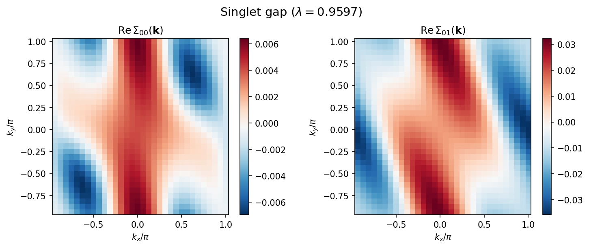
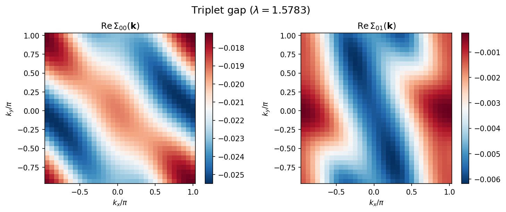
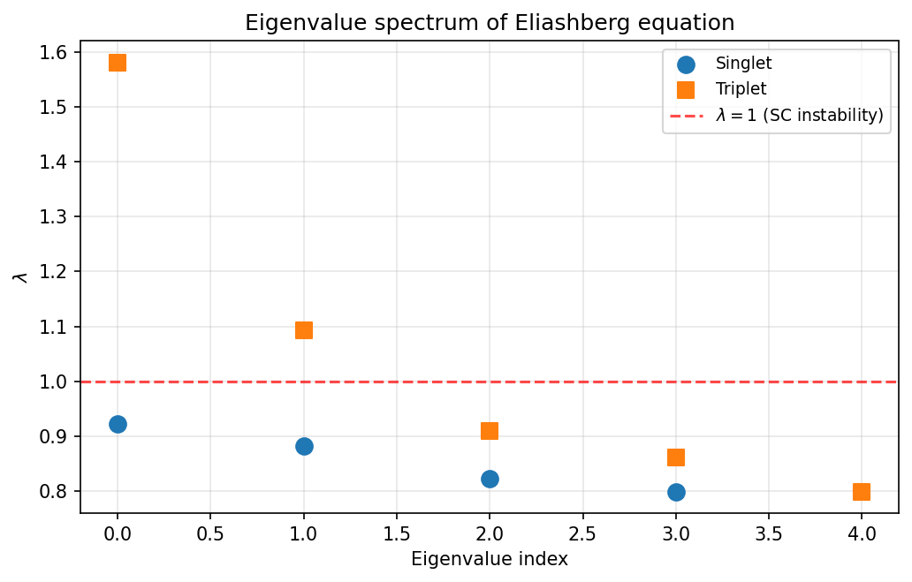

=============================================
チュートリアル: Eliashberg方程式ソルバー
=============================================

本チュートリアルでは、H-waveに含まれる線形化Eliashberg方程式ソルバー
``hwave_sc`` の使い方を説明します。
このツールは、RPAソルバーで計算した裸感受率 :math:`\chi_0(\mathbf{q})`
を用いて線形化Eliashberg方程式を解き、超伝導不安定性を解析します。

サンプルファイルは ``docs/ja/source/rpa/sample_sc`` ディレクトリにあります。

計算の流れ
----------------------------

計算は2つのステップで行います:

1. **RPA計算** (``hwave``): 裸感受率 :math:`\chi_0(\mathbf{q})` を計算し、
   ``chi0q.npz`` に保存します。
2. **Eliashberg方程式ソルバー** (``hwave_sc``): ``chi0q.npz`` を読み込み、
   グリーン関数を再構成し、RPA頂点を計算した後、
   線形化Eliashberg方程式を解きます。

モデル
----------------------------

本チュートリアルでは、二次元正方格子上の **2軌道タイトバインディングモデル**
を3/4フィリングで扱います。ハミルトニアンは以下の通りです:

.. math::

   H = \sum_{\mathbf{k},\alpha,\beta,\sigma}
       \varepsilon_{\alpha\beta}(\mathbf{k})\,
       c^\dagger_{\mathbf{k}\alpha\sigma} c_{\mathbf{k}\beta\sigma}
     + U \sum_{i,\alpha} n_{i\alpha\uparrow} n_{i\alpha\downarrow}
     + \sum_{i,\alpha\neq\beta} V_{\alpha\beta}\,
       n_{i\alpha} n_{i\beta}

ここで、オンサイトクーロン斥力 :math:`U = 0.4`、
軌道間クーロン相互作用 :math:`V` を使用します。

このサンプルは有機導体 :math:`\beta`\ -(meso-DMBEDT-TTF)\ :math:`_2`\ PF\ :math:`_6`
の伝導層モデルに基づいており、
トランスファー積分は拡張ヒュッケル法による計算値を使用しています。 [1]_

理論
----------------------------

超伝導感受率
^^^^^^^^^^^^^^^^^^^^^^^^^^^^^^^^

RPA電荷感受率 :math:`\hat{X}^c` およびスピン感受率 :math:`\hat{X}^s` は
以下のように与えられます:

.. math::

   \hat{X}^c = (\hat{I} + \hat{X}^{(0)} (\hat{U} + 2\hat{V}))^{-1} \hat{X}^{(0)}

.. math::

   \hat{X}^s = (\hat{I} - \hat{X}^{(0)} \hat{U})^{-1} \hat{X}^{(0)}

ここで :math:`\hat{X}^{(0)}` は裸感受率、
:math:`\hat{U}` はオンサイト相互作用行列、
:math:`\hat{V}` はサイト間相互作用行列です。

線形化Eliashberg方程式
^^^^^^^^^^^^^^^^^^^^^^^^^^^^^^^^

一重項超伝導の線形化Eliashberg方程式は次のように書けます:

.. math::

   \lambda_S \Sigma^a_{\alpha\sigma;\beta\bar{\sigma}}(\mathbf{k})
   = -\frac{T}{N_L} \sum_{\mathbf{k}',n',\alpha',\beta'}
   P^S_{\alpha\sigma;\beta\bar{\sigma}}(\mathbf{k} - \mathbf{k}')
   G^{(0)}_{\alpha\alpha'}(\mathbf{k}', i\varepsilon_{n'})
   G^{(0)}_{\beta\beta'}(-\mathbf{k}', -i\varepsilon_{n'})
   \Sigma^a_{\alpha'\sigma;\beta'\bar{\sigma}}(\mathbf{k}')

ペアリング相互作用は、一重項の場合:

.. math::

   \hat{P}^S = \hat{U} + \hat{V}
   + \frac{3}{2} \hat{U} \hat{X}^s \hat{U}
   - \frac{1}{2} (\hat{U} + 2\hat{V}) \hat{X}^c (\hat{U} + 2\hat{V})

三重項の場合:

.. math::

   \hat{P}^T = \hat{V}
   - \frac{1}{2} \hat{U} \hat{X}^s \hat{U}
   - \frac{1}{2} (\hat{U} + 2\hat{V}) \hat{X}^c (\hat{U} + 2\hat{V})

:math:`\lambda_S = 1` (:math:`\lambda_T = 1`) が超伝導転移点に対応します。
:math:`\lambda > 1` （正の固有値）のとき常伝導状態は超伝導に対して不安定です。
負の固有値は符号反転ギャップに対応しますが、
自己無撞着条件 :math:`\Delta = K\Delta` を満たさないため
超伝導不安定性を示しません。

Eliashberg方程式の数値解法として、``hwave_sc`` では自己無撞着べき乗反復法
（固有値が最大のモードに収束）とArnoldi法による固有値解析を実装しています。

.. [1] K. Yoshimi, M. Nakamura, and H. Mori,
   J. Phys. Soc. Jpn. **76**, 024706 (2007);
   `arXiv:cond-mat/0608466 <https://arxiv.org/abs/cond-mat/0608466>`_.

入力ファイルの準備
----------------------------

パラメータファイル
^^^^^^^^^^^^^^^^^^^^^^^^^^^^^^^^

TOML形式のパラメータファイル ``input.toml`` を作成します:

.. literalinclude:: ../sample_sc/input.toml

このファイルは以下のセクションから構成されます。

``[mode.param]`` セクション
""""""""""""""""""""""""""""""""

- ``T``: 温度。
- ``CellShape``: k点メッシュのサイズ（2次元系では 32 x 32 x 1）。
- ``Nmat``: 松原振動数の数（512）。
- ``filling``: 1軌道1スピンあたりの電子充填率（0.75 = 3/4フィリング）。

``[file]`` セクション
""""""""""""""""""""""""""""""""

- ``[file.input.interaction]``: 幾何情報、トランスファー積分、
  相互作用パラメータのファイルを指定します。RPAステップと共通です。
- ``[file.output]``: :math:`\chi_0(\mathbf{q})` および
  :math:`\chi(\mathbf{q})` の出力先ディレクトリとファイル名。

``[eliashberg]`` セクション
""""""""""""""""""""""""""""""""

Eliashberg方程式ソルバーの設定です。主なパラメータ:

- ``solver_mode``: ``"iteration"`` (自己無撞着べき乗法)、
  ``"eigenvalue"`` (Arnoldi固有値解析)、または ``"both"``。
- ``chi0q_mode``: ``"load"`` はRPA出力ファイルから
  :math:`\chi_0(\mathbf{q})` を読み込みます。
  ``"calc"`` は内部で計算します。
- ``pairing_type``: ``"singlet"`` または ``"triplet"``。
- ``init_gap``: 反復法の初期ギャップ対称性。
  ``"cos"`` (:math:`\cos k_x + \cos k_y`)、
  ``"dx2y2"`` (:math:`\cos k_x - \cos k_y`)、
  ``"random"`` などが利用可能です。
- ``max_iter``: 自己無撞着反復の最大回数。
- ``alpha``: 混合パラメータ（0: 混合なし、1: 古い解を完全保持）。
- ``convergence_tol``: ギャップ関数の収束条件。
- ``num_eigenvalues``: 固有値モードで計算する固有値の数。
- ``eigenvalue_method``: ``"arnoldi"`` （デフォルト）、 ``"subspace"`` 、
  ``"shift-invert-gmres"`` / ``"shift-invert-bicgstab"`` /
  ``"shift-invert-lgmres"``。

相互作用定義ファイル
^^^^^^^^^^^^^^^^^^^^^^^^^^^^^^^^

相互作用定義ファイルはWannier90形式で記述し、
RPAソルバーと共通です。詳細は :ref:`Ch:Config_rpa` を参照してください。

``Geometry`` (``geom.dat``):

.. literalinclude:: ../sample_sc/geom.dat

2軌道の単位胞を定義します。

``Transfer`` (``transfer.dat``):

.. literalinclude:: ../sample_sc/transfer.dat

2軌道モデルのホッピング積分を定義します。

``CoulombIntra`` (``coulombintra.dat``):

.. literalinclude:: ../sample_sc/coulombintra.dat

各軌道のオンサイトクーロン斥力 :math:`U = 0.4`。

``CoulombInter`` (``coulombinter.dat``):

.. literalinclude:: ../sample_sc/coulombinter.dat

軌道間・サイト間クーロン相互作用。

ステップ1: RPA計算の実行
----------------------------

まず、RPAソルバーを実行して裸感受率を計算します:

.. code-block:: bash

    $ hwave input.toml

``output/chi0q.npz`` と ``output/chiq.npz`` が生成されます。
32 x 32メッシュの場合、数秒で完了します。

ステップ2: Eliashberg方程式ソルバーの実行
---------------------------------------------

次に、同じ入力ファイルを使ってEliashberg方程式ソルバーを実行します:

.. code-block:: bash

    $ hwave_sc input.toml

ソルバーは以下の処理を行います:

1. ``output/chi0q.npz`` から :math:`\chi_0(\mathbf{q})` を読み込みます。
2. 相互作用ファイルを読み込み、ハミルトニアンを構築します。
3. 非相互作用グリーン関数 :math:`G(\mathbf{k}, i\omega_n)` を構成します。
4. RPA電荷・スピン頂点 :math:`V_c(\mathbf{q})`、
   :math:`V_s(\mathbf{q})` を計算します。
5. 線形化Eliashberg方程式を自己無撞着反復法および/または
   固有値解析で解きます。

実行ログの例:

.. code-block:: text

    hwave_sc: === Self-consistent iteration ===
    hwave_sc: Iteration    0: eigenvalue = 0.924446, diff = 3.544353e-01
    hwave_sc: Iteration    1: eigenvalue = 0.817270, diff = 7.893848e-02
    ...
    hwave_sc: Iteration  192: eigenvalue = 0.959725, diff = 9.900091e-06
    hwave_sc: Converged at iteration 193
    hwave_sc: Iteration result: eigenvalue = 0.959725, converged = True, n_iter = 193

引き続き固有値解析の結果が表示されます:

.. code-block:: text

    hwave_sc: === Eigenvalue analysis ===
    hwave_sc: Leading eigenvalues:
    hwave_sc:     0: -1.345390 (|ev| = 1.345390)
    hwave_sc:     1: -1.121834 (|ev| = 1.121834)
    hwave_sc:     2: -1.100188 (|ev| = 1.100188)
    ...
    hwave_sc:     4: 0.922684 (|ev| = 0.922684)

正の固有値 :math:`\lambda > 1` は、その温度で超伝導不安定性が
存在することを示します。負の固有値は符号反転ギャップに対応しますが、
超伝導不安定性は示しません。

計算結果
----------------------------

ギャップ関数
^^^^^^^^^^^^^^^^^^^^^^^^^^^^^^^^

以下の図は、自己無撞着反復から得られた
ギャップ関数 :math:`\Sigma_{\alpha\beta}(\mathbf{k})`
の運動量空間での分布を示しています。

**一重項チャネル** (:math:`\lambda \approx 0.96`):

   一重項ギャップ関数のk空間分布。
   左: 軌道内成分 :math:`\mathrm{Re}\,\Sigma_{00}(\mathbf{k})`。
   右: 軌道間成分 :math:`\mathrm{Re}\,\Sigma_{01}(\mathbf{k})`。
   軌道間成分が軌道内成分の約5倍大きく、
   軌道間ペアリングが支配的であることを示す。

**三重項チャネル** (:math:`\lambda \approx 1.58`):

   三重項ギャップ関数のk空間分布。
   左: 軌道内成分 :math:`\mathrm{Re}\,\Sigma_{00}(\mathbf{k})`。
   右: 軌道間成分 :math:`\mathrm{Re}\,\Sigma_{01}(\mathbf{k})`。
   一重項の場合とは異なり、軌道内成分が支配的である。

固有値スペクトル
^^^^^^^^^^^^^^^^^^^^^^^^^^^^^^^^

一重項・三重項チャネルのEliashberg方程式の固有値スペクトルを以下に示します。

   線形化Eliashberg方程式の正の固有値スペクトル :math:`\lambda` 。
   赤破線は :math:`\lambda = 1` （超伝導不安定性の判定基準）を示す。
   一重項の全固有値は1未満であり、三重項では2つの固有値が1を超えている。

Arnoldi固有値解析は複数の固有値を検出します。
図には超伝導不安定性の判定基準 :math:`\lambda = 1` に関連する
正の固有値のみを示しています。
一重項チャネルでは最大の正の固有値が :math:`\lambda \approx 0.92 < 1` であり、
自己無撞着反復法の結果 （ :math:`\lambda \approx 0.96` ）と一致します。
この温度では一重項SC不安定性は存在しません。

三重項チャネルでは、最大の正の固有値が
:math:`\lambda \approx 1.58 > 1` であり、
三重項SC不安定性を示しています。

描画スクリプト
^^^^^^^^^^^^^^^^^^^^^^^^^^^^^^^^

上記の図はサンプルディレクトリに含まれる描画スクリプトで再現できます:

.. code-block:: bash

    $ python plot_results.py

出力ファイル
----------------------------

ソルバーは ``output`` ディレクトリに以下のファイルを出力します。

``gap.dat``
^^^^^^^^^^^^^^^^^^^^^^^^^^^^^^^^

収束したギャップ関数 :math:`\Delta_{\alpha\beta}(\mathbf{k})`
のk空間表示。各行の形式:

.. code-block:: text

    kx  ky  kz  Re(Δ_00)  Im(Δ_00)  Re(Δ_01)  Im(Δ_01)  Re(Δ_10)  Im(Δ_10)  Re(Δ_11)  Im(Δ_11)

ここで :math:`\alpha, \beta` は軌道インデックスです。

``eigenvalue.dat``
^^^^^^^^^^^^^^^^^^^^^^^^^^^^^^^^

線形化Eliashberg方程式の固有値:

.. code-block:: text

    # Iteration eigenvalue
    9.59724792e-01
    # Eigenvalue analysis
    # index  Re(eigenvalue)  Im(eigenvalue)  |eigenvalue|
       0 -1.34539047e+00  0.00000000e+00  1.34539047e+00
       1 -1.12183387e+00  0.00000000e+00  1.12183387e+00
       ...

物理的解釈
----------------------------

線形化Eliashberg方程式の最大固有値 :math:`\lambda` は
超伝導の発生を判定します:

- :math:`\lambda > 1`: 常伝導状態は超伝導に対して不安定です。
  対応する固有ベクトルがギャップ関数の対称性を与えます。
- :math:`\lambda < 1` （全ての正の固有値について）:
  その温度では常伝導状態が安定です。

負の固有値は、多軌道系における :math:`s_\pm` 波のような
符号反転ペアリング対称性に対応しますが、
自己無撞着条件 :math:`\Delta = K\Delta` は :math:`\lambda = 1`
（ :math:`\lambda = -1` ではない）を要求するため、
負の固有値はその大きさによらず超伝導不安定性を **示しません** 。

温度を変化させて最大の正の固有値が :math:`\lambda = 1` となる点を
求めることで、超伝導転移温度 :math:`T_c` を決定できます。

本チュートリアルでは、:math:`T = 0.1` で一重項チャネルの最大正固有値が
:math:`\lambda_S \approx 0.96 < 1` （SC不安定性なし）、
三重項チャネルでは :math:`\lambda_T \approx 1.58 > 1`
（SC不安定性あり）となります。

一重項と三重項の比較
^^^^^^^^^^^^^^^^^^^^^^^^^^^^^^^^

入力ファイルの ``pairing_type`` を ``"triplet"`` に変更することで、
一重項と三重項の不安定性を比較できます。
同じパラメータで :math:`T = 0.1` の場合、三重項チャネルでは
主要固有値が :math:`\lambda_T \approx 1.58` となり、
一重項の値 (:math:`\lambda_S \approx 0.96`) より大きくなります。
これは、この温度では三重項SC状態が支配的であることを示し、
文献 [1]_ の結果と一致しています。
同文献では、:math:`T > 0.05` で三重項SC状態が一重項SC状態と
競合し、低温 (:math:`T < 0.05`) ではスピンゆらぎの増大により
一重項SC転移が支配的になることが報告されています。

対応する相互作用
----------------------------

Eliashberg方程式ソルバーは、H-waveで利用可能な
全ての相互作用型に対応しています:

- ``CoulombIntra`` (:math:`U`): 軌道内クーロン斥力
- ``CoulombInter`` (:math:`V`): 軌道間クーロン斥力
- ``Hund`` (:math:`J`): フント結合
- ``Exchange`` (:math:`J'`): ペアホッピング（交換）
- ``Ising`` (:math:`I`): イジング型スピン相互作用
- ``PairHop`` (:math:`P`): ペアホッピング

``Hund``、``Exchange``、``Ising``、``PairHop``
相互作用が存在する場合、ソルバーは自動的に
一般化 :math:`S`/:math:`C` 行列定式化
（Kuroki et al., PRB 79, 224511）を使用し、
4インデックスの頂点構造で計算します。

Tips
----------------------------

- 大規模系では ``chi0q_mode = "calc"`` と設定すると、
  :math:`\chi_0(\mathbf{q})` を内部計算し、
  大きなファイルの読み込みを回避できます。
- ``"arnoldi"`` 固有値法は少数の主要固有値を求めるのに最速です。
  縮退した固有値がある場合は ``"subspace"`` がより堅牢です。
- 反復法では異なる ``init_gap`` 対称性を使用して、
  特定のペアリングチャネルを狙うことができます。
  固有値法は全ての主要対称性を自動的に見つけます。
- ``pairing_type = "triplet"`` オプションで、
  適切な頂点を用いた三重項ペアリング不安定性を解析できます。
