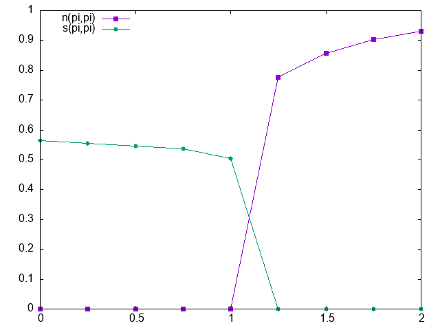

# Sample for sweeping parameter

## What's this sample?

This sample calculates the offsite Coulomb dependence of charge density wave (CDW) order parameter and spin density wave (SDW) order parameter of Hubbard model with the onsite Coulomb U/t=4 on square lattice.

## Preparation

Make sure that both `hwave` package (this project) and `uhf_dry.out` of `StdFace` are installed.

## How to run

```bash
python3 run.py [path_to_uhf_dry_out]
```

The result file `res.dat` will be saved.
In `res.dat`, the first column is offsite Coulomb V, the second column is the CDW order parameter n(pi,pi), and the third column is the SDW order parameter s(pi,pi).

`plot.plt` is a gnuplot script to plot n and s curves:

```bash
gnuplot plot.plt
```


