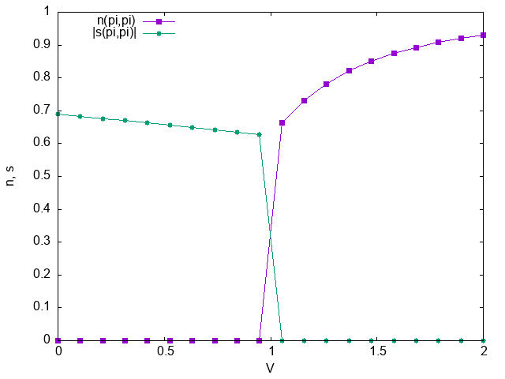

# Sample for sweeping parameter

## What's this sample?

This sample calculates the offsite Coulomb (V) dependence of charge density wave (CDW) order parameter and spin density wave (SDW) order parameter of Hubbard model with the onsite Coulomb U=4 on square lattice (hopping constant t=1).
For the UHF calculation, the choice of the initial state (Green's function) is important because the phase transition between CDW and SDW is first-order.
Therefore, for each parameter V, the sample script (`run.py`) performs UHF-k calculations with two initial states, CDW and SDW, and compares the energies to determine whether is the ground state.

## Preparation

Make sure that both `hwave` package (this project) and `uhf_dry.out` of `StdFace` are installed.

## How to run

```bash
python3 run.py [path_to_uhf_dry_out]
```

The result file `res.dat` will be saved.
In `res.dat`, the 1st column is offsite Coulomb V.
The 2nd, 3rd, and 4th columns are the total energy E, the CDW order parameter n(pi,pi), and the SDW order parameter |s(pi,pi)| of the ground state, respectively.
The 5th-7th columns are E, n(pi,pi), and |s(pi,pi)| of the obtained state from a CDW state.
The 8th-10th columns are E, n(pi,pi), and |s(pi,pi)| of the obtained state from a SDW state.
The last column shows which phase is stable, "cdw" or "sdw".

`plot.plt` is a gnuplot script to plot n and s curves:

```bash
gnuplot plot.plt
```


