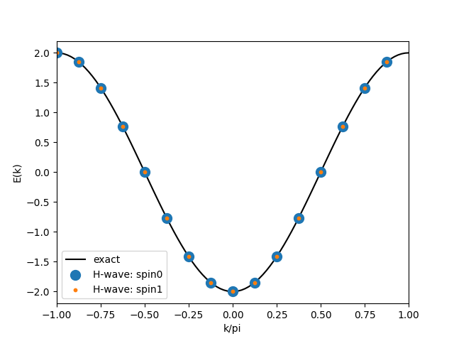

# Sample for plotting band

## What's this sample?

This is the sample for calculating the band of a tight-binding model on chain.

## Preparation

Make sure that both `hwave` package (this project) and `uhf_dry.out` of `StdFace` are installed.
We use `matplotlib` to plot the result.
If you have not installed it, please run the following command.

```bash
python3 -m pip install matplotlib
```

## How to run

```bash
uhf_dry.out stan.in
python3 output_band.py  
```

After running the commands above, the result files `band.dat` and `band.png` are outputted.
`band.dat` includes the info of the wavenumbers and the band energies.

`band.png` is the figure of the band dispersion plotted by `matplotlib`, which is shown as the following figure.



You can get the similar figure by using `gnuplot`.

```bash
gnuplot plot.plt
```